# SentinelAI
## Enterprise AI-Powered Cyber Risk Intelligence & Governance Platform

**Document Type:** Architecture & Design Document  
**Version:** 1.0  
**Domain:** Cybersecurity • Governance, Risk & Compliance (GRC) • Enterprise AI  
**Category:** Enterprise AI Risk Intelligence Platform  

---

## Table of Contents
1. [Executive Summary](#1-executive-summary)
2. [Problem Statement](#2-problem-statement)
   - [2.1 Current Challenges](#21-current-challenges)
   - [2.2 Existing Solutions & Limitations](#22-existing-solutions--limitations)
   - [2.3 Why This Problem Matters](#23-why-this-problem-matters)
3. [Objectives](#3-objectives)
4. [Proposed Solution & Project Vision](#4-proposed-solution--project-vision)
   - [4.1 Proposed Solution](#41-proposed-solution)
   - [4.2 Core Innovation](#42-core-innovation)
   - [4.3 Project Vision](#43-project-vision)
5. [Business Justification & Market Need](#5-business-justification--market-need)
   - [5.1 Industry Overview](#51-industry-overview)
   - [5.2 Business Need](#52-business-need)
   - [5.3 Business Benefits](#53-business-benefits)
   - [5.4 Strategic Value Proposition](#54-strategic-value-proposition)
6. [User Personas](#6-user-personas)
7. [System Architecture](#7-system-architecture)
   - [7.1 Architecture Overview](#71-architecture-overview)
   - [7.2 Component Architecture](#72-component-architecture)
   - [7.3 Data Flow](#73-data-flow)
8. [Functional Requirements](#8-functional-requirements)
9. [Non-Functional Requirements](#9-non-functional-requirements)
10. [Technology Stack](#10-technology-stack)
11. [Working Mechanism](#11-working-mechanism)
    - [11.1 Enterprise Data Ingestion & Integration Engine](#111-enterprise-data-ingestion--integration-engine)
    - [11.2 Knowledge Graph & Risk Intelligence Engine](#112-knowledge-graph--risk-intelligence-engine)
    - [11.3 AI Decision Intelligence Pipeline](#113-ai-decision-intelligence-pipeline)
    - [11.4 End-to-End Runtime Trace](#114-end-to-end-runtime-trace)
12. [AI / ML Components](#12-aiml-components)
13. [Security Architecture](#13-security-architecture)
14. [Scalability & Performance](#14-scalability--performance)
15. [Database & State Design](#15-database--state-design)
16. [API Design](#16-api-design)
17. [Deployment Architecture](#17-deployment-architecture)
18. [Monitoring & Observability](#18-monitoring--observability)
19. [Risks & Mitigation](#19-risks--mitigation)
20. [Competitive Analysis & USP](#20-competitive-analysis--usp)
21. [Implementation Roadmap](#21-implementation-roadmap)
22. [Success Metrics (KPIs)](#22-success-metrics-kpis)
23. [Conclusion](#23-conclusion)
24. [Addendum: How SentinelAI Works (Stage-by-Stage)](#addendum-how-sentinelai-works-stage-by-stage)

---

# 1. Executive Summary

Digital transformation has fundamentally changed the cybersecurity landscape. Modern enterprises now operate thousands of interconnected digital assets across:
- **On-premises infrastructure**
- **Multi-cloud environments**
- **Software-as-a-Service (SaaS) platforms**
- **Internet of Things (IoT) devices**
- **Identity providers**
- **Application Programming Interfaces (APIs)**
- **Third-party ecosystems**

While organizations have invested heavily in specialized cybersecurity solutions—including `Security Information and Event Management (SIEM)`, `Endpoint Detection and Response (EDR)`, `Identity and Access Management (IAM)`, `Vulnerability Management`, `Cloud Security Posture Management (CSPM)`, and `Governance, Risk & Compliance (GRC) platforms`—these systems frequently operate as isolated silos.

### The Challenge of Siloed Security
The result of these silos is an overwhelming volume of fragmented alerts, disconnected security findings, inconsistent risk assessments, and significant manual effort required to understand the true security posture of an organization. 
- **Time Consumption:** Security analysts often spend more time correlating information from multiple tools than performing actual risk mitigation. 
- **Lack of Context:** Existing dashboards generally provide visibility into individual domains but rarely deliver contextual understanding of how vulnerabilities, identities, assets, compliance requirements, and business services interact to create organizational risk.

### The SentinelAI Solution
SentinelAI addresses this challenge by introducing an enterprise-grade **Cyber Risk Intelligence Platform** that combines deterministic analytics, knowledge graph technology, explainable artificial intelligence, and business-context-driven prioritization into a unified decision-support system.

**Knowledge Graph Integration:**
Unlike conventional security dashboards that merely aggregate alerts, SentinelAI constructs an interconnected enterprise knowledge graph representing assets, users, identities, vulnerabilities, business services, cloud resources, compliance controls, and their relationships. 
*This graph becomes the organization's digital security model, enabling sophisticated relationship analysis, attack-path discovery, dependency mapping, and contextual risk propagation.*

**Hybrid Intelligence Architecture:**
Artificial Intelligence is integrated carefully within the platform. Rather than allowing Large Language Models (LLMs) to independently determine security decisions, SentinelAI adopts a Hybrid Intelligence Architecture. 
1. **Deterministic Phase:** Deterministic graph algorithms, enterprise policies, and rule-based evaluation first establish objective security facts. 
2. **AI Augmentation Phase:** AI then augments these deterministic results by generating explainable recommendations, executive summaries, remediation guidance, and natural language interaction while remaining grounded in verified enterprise data.

### Core Innovation & Business Value
A core innovation of SentinelAI is its **Explainable Risk Intelligence Engine**, which produces transparent and evidence-backed recommendations instead of opaque AI-generated conclusions. 
- Every recommendation is accompanied by supporting graph relationships, affected business assets, policy mappings, vulnerability evidence, and confidence indicators.
- This enables security teams to validate and trust AI-assisted decisions.

**From a business perspective, SentinelAI:**
- `Significantly reduces investigation time`
- `Minimizes alert fatigue`
- `Accelerates remediation prioritization`
- `Enhances compliance readiness`
- `Improves organizational cyber resilience`

Rather than replacing existing enterprise security investments, the platform acts as an **intelligent orchestration and contextual intelligence layer** that amplifies the value of deployed security technologies.

### Technical Design Principles
Technically, SentinelAI is designed using modern enterprise architecture principles including:
- Modular microservices
- Event-driven data processing
- Scalable graph databases
- Retrieval-Augmented Generation (RAG)
- Secure API-first communication
- Cloud-native deployment
- Comprehensive observability

These design choices ensure that the platform can scale from mid-sized enterprises to large multinational organizations while maintaining security, reliability, maintainability, and extensibility.

> [!NOTE] 
> **Key Takeaway:** SentinelAI represents a next-generation approach to enterprise cyber risk management—transforming fragmented security telemetry into actionable, explainable, and business-aligned intelligence that empowers organizations to make faster, more informed security decisions.

---

# 2. Problem Statement

## 2.1 Current Challenges
Enterprise cybersecurity has evolved into one of the most complex operational challenges faced by modern organizations. As businesses adopt cloud-native architectures, hybrid infrastructures, remote work models, and interconnected digital ecosystems, the volume of security data generated each day has increased exponentially. 

Organizations routinely deploy dozens of specialized security products, each producing valuable but isolated insights into specific domains such as identity management, vulnerability assessment, endpoint protection, network monitoring, cloud security, and regulatory compliance.

While these tools excel within their respective areas, they rarely communicate effectively with one another. Consequently, security analysts are required to manually correlate thousands of alerts, vulnerabilities, asset inventories, user identities, configuration findings, and compliance requirements before they can accurately determine the organization's true risk posture.

This fragmented operational model introduces several significant challenges:

| Challenge | Description | Business Impact |
| :--- | :--- | :--- |
| **Fragmented Security Visibility** | Security data remains distributed across multiple independent systems. | High |
| **Alert Fatigue** | Analysts receive thousands of alerts daily, many of which represent duplicate or low-priority events. | Critical |
| **Lack of Contextual Correlation** | Existing tools struggle to identify relationships between vulnerabilities, assets, identities, and business services. | High |
| **Manual Risk Prioritization** | Security teams rely heavily on human expertise to determine remediation priorities. | High |
| **Inconsistent Risk Scoring** | Different products assign different severity scores for similar findings. | Medium |
| **Compliance Complexity** | Evidence collection for audits remains largely manual. | High |
| **Limited Explainability** | AI assistants frequently provide recommendations without sufficient evidence or reasoning. | High |
| **Siloed Decision Making** | Individual teams optimize within their own security domain rather than organizational risk. | High |
| **Delayed Incident Response** | Manual investigation increases Mean Time to Detect (MTTD) and Mean Time to Respond (MTTR). | Critical |
| **Growing Infrastructure Complexity** | Hybrid cloud, SaaS, containers, APIs, and IoT continuously expand the enterprise attack surface. | Critical |

> [!WARNING]
> These challenges collectively reduce operational efficiency, increase investigation costs, and expose organizations to preventable cyber risks.

## 2.2 Existing Solutions & Limitations
Current cybersecurity platforms provide valuable capabilities within specific domains but often fail to deliver holistic, contextual, and business-aware risk intelligence.

| Existing Approach | Key Limitation |
| :--- | :--- |
| **SIEM Platforms** | Aggregate logs effectively but provide limited contextual business risk analysis. |
| **Vulnerability Management Solutions** | Prioritize vulnerabilities primarily using CVSS scores without organizational context. |
| **SOAR Platforms** | Automate predefined workflows but depend heavily on manually authored playbooks. |
| **CSPM Platforms** | Focus on cloud posture while lacking enterprise-wide relationship analysis. |
| **EDR Solutions** | Provide endpoint visibility but limited understanding of broader organizational dependencies. |
| **GRC Platforms** | Excellent for governance documentation but weak in real-time operational intelligence. |
| **AI Security Assistants** | Offer natural language summaries but frequently lack deterministic validation and explainability. |
| **Traditional Dashboards** | Display metrics without correlating business assets, identities, vulnerabilities, and compliance requirements into a unified intelligence model. |

While these solutions remain essential components of enterprise security ecosystems, **none independently deliver explainable, graph-driven, AI-assisted cyber risk intelligence spanning the entire organization.**

## 2.3 Why This Problem Matters
The inability to accurately prioritize cyber risk has become one of the most significant operational bottlenecks within enterprise security programs.

**Operational Impacts:**
- When security findings remain disconnected across multiple platforms, organizations struggle to identify which issues genuinely threaten critical business operations.
- Analysts spend substantial time collecting evidence rather than making informed decisions.
- Executives lack reliable visibility into organizational cyber risk.

**Business Repercussions:**
This gap between technical security data and business decision-making leads to:
1. Slower remediation
2. Increased operational costs
3. Compliance challenges
4. Elevated exposure to sophisticated cyber threats

**The Solution Goal:**
SentinelAI addresses this challenge by introducing contextual intelligence into enterprise cybersecurity. Through knowledge graph analytics, deterministic risk evaluation, and explainable AI reasoning, the platform enables organizations to transition from reactive alert management toward proactive, evidence-based cyber risk governance.

---

# 3. Objectives
SentinelAI is designed to evolve beyond a conventional security dashboard into an enterprise cyber decision intelligence platform. Its objectives are structured to align with business outcomes, operational efficiency, and technical scalability.

| ID | Objective | Success Criterion |
| :--- | :--- | :--- |
| **O1** | Unify enterprise security data into a single contextual intelligence platform | Integrate data from all supported enterprise security sources into a unified data model |
| **O2** | Build an enterprise Knowledge Graph representing assets, users, identities, vulnerabilities, policies, and business services | 100% of ingested entities represented through graph relationships |
| **O3** | Reduce analyst investigation effort through contextual risk correlation | Reduce Mean Time to Investigate (MTTI) by at least 40% |
| **O4** | Deliver explainable AI-assisted risk recommendations | Every AI recommendation includes evidence, graph reasoning, and confidence score |
| **O5** | Prioritize security risks using business context rather than isolated severity metrics | Risk prioritization incorporates asset criticality, exposure, exploitability, and business impact |
| **O6** | Improve executive cyber visibility | Provide organization-wide risk dashboards with real-time updates |
| **O7** | Support compliance readiness | Automatically map technical findings to regulatory controls and compliance frameworks |
| **O8** | Enable scalable enterprise deployment | Support distributed, cloud-native deployment with horizontal scalability |
| **O9** | Provide open integration capabilities | Expose REST APIs and event-driven interfaces for enterprise ecosystems |
| **O10**| Maintain deterministic security reasoning | Ensure AI augments—not replaces—deterministic graph and rule-based analysis |

---

# 4. Proposed Solution & Project Vision

## 4.1 Proposed Solution
SentinelAI is an enterprise AI-powered cyber risk intelligence platform that transforms fragmented security telemetry into explainable, contextual, and actionable organizational intelligence.

Rather than functioning as another security monitoring tool, SentinelAI serves as an intelligence layer positioned above existing enterprise security products. 

**Core Process:**
1. Continuously collects information from multiple security systems.
2. Normalizes heterogeneous datasets into a canonical enterprise model.
3. Constructs an interconnected Knowledge Graph.
4. Evaluates organizational risk using deterministic graph analytics.
5. Augments these results with explainable artificial intelligence.

### Architectural Separation
The architecture deliberately separates deterministic reasoning from AI reasoning to ensure accuracy and trust.

**Deterministic components establish factual knowledge:**
- Asset discovery
- Identity relationships
- Vulnerability mapping
- Attack path analysis
- Compliance mapping
- Business dependency analysis
- Graph traversal
- Risk propagation

**Artificial Intelligence is subsequently used to:**
- Explain findings
- Summarize organizational risk
- Recommend remediation strategies
- Generate executive reports
- Answer natural language questions
- Provide interactive security assistance

> [!IMPORTANT]
> This architectural separation ensures that AI recommendations remain grounded in verified enterprise data rather than probabilistic assumptions.

## 4.2 Core Innovation
SentinelAI introduces several innovations that collectively distinguish it from conventional cybersecurity platforms.

### 1. Knowledge Graph-Based Enterprise Intelligence
Instead of storing isolated security records in relational tables, SentinelAI models the organization as an interconnected graph where every entity possesses meaningful relationships.

**Example Relationship Flow:**
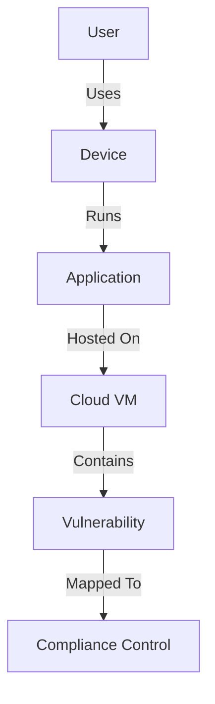
This structure enables contextual reasoning that conventional dashboards cannot perform.

### 2. Explainable Hybrid Intelligence
Rather than allowing LLMs to directly determine risk scores, SentinelAI combines deterministic analytics with AI reasoning.

**The Decision Flow:**
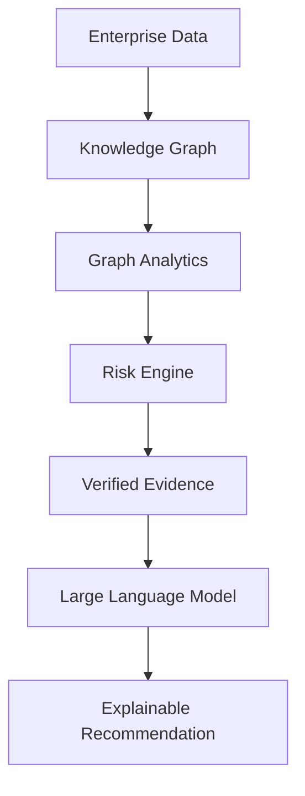
This architecture significantly reduces hallucination risk while improving analyst trust.

### 3. Business-Aware Risk Prioritization
Traditional vulnerability scoring frequently relies on static severity metrics. SentinelAI instead evaluates multiple dimensions to create an **organizational risk score** rather than an isolated vulnerability score:
- Technical severity
- Asset criticality
- Identity privilege
- Network exposure
- Business dependency
- Regulatory impact
- Threat intelligence
- Graph centrality
- Lateral movement potential

### 4. Continuous Organizational Knowledge Model
The platform continuously updates its enterprise graph as infrastructure evolves. 

Whenever changes occur, the graph automatically incorporates these changes, allowing risk intelligence to remain current:
- New assets appear
- Identities change
- Vulnerabilities emerge
- Compliance controls evolve
- Cloud resources are created

## 4.3 Project Vision
SentinelAI is envisioned as a multi-phase enterprise platform that evolves from contextual risk visualization into an autonomous cyber decision intelligence ecosystem.

| Version | Focus | Major Capabilities |
| :--- | :--- | :--- |
| **V1 – Intelligent Visibility** | Unified enterprise cyber intelligence | Multi-source ingestion, Knowledge Graph, explainable dashboards, AI assistant |
| **V2 – Predictive Risk Intelligence** | Proactive security analysis | Risk forecasting, attack path prediction, business impact simulation |
| **V3 – Autonomous Decision Support** | AI-assisted operational security | Automated remediation recommendations, policy optimization, adaptive prioritization |
| **V4 – Enterprise Cyber Digital Twin** | Organizational cyber simulation | Digital twin modeling, scenario simulation, resilience testing, strategic planning |

> [!NOTE]
> Long term, SentinelAI aims to become an enterprise cyber operating system where organizational risk is continuously modeled, analyzed, explained, and optimized.

---

# 5. Business Justification & Market Need

## 5.1 Industry Overview
The cybersecurity landscape continues to expand as organizations adopt cloud computing, remote work, artificial intelligence, and increasingly interconnected digital ecosystems. This growth has significantly increased both the volume of security telemetry and the complexity of cyber risk management.

Enterprises now rely on numerous specialized security platforms—including SIEM, EDR, CSPM, IAM, vulnerability management, and GRC tools—each generating valuable but isolated insights. The resulting fragmentation creates operational inefficiencies, making contextual risk analysis and executive decision-making increasingly difficult.

Industry research consistently identifies the convergence of AI-driven security operations, cyber resilience, and governance automation as major priorities for enterprise security programs, highlighting the growing demand for platforms that unify data, provide explainable intelligence, and improve operational efficiency. These trends align closely with SentinelAI's architectural vision.

## 5.2 Business Need
Organizations increasingly require platforms capable of:
- Unifying distributed security data
- Prioritizing risks using organizational context
- Reducing analyst workload
- Improving executive visibility
- Accelerating compliance reporting
- Supporting AI-assisted decision making
- Increasing return on existing security investments

SentinelAI addresses these requirements without requiring organizations to replace their current security ecosystem.

## 5.3 Business Benefits

| Business Benefit | Detail |
| :--- | :--- |
| **Unified Security Visibility** | Consolidates security intelligence from multiple enterprise systems into one contextual platform |
| **Reduced Investigation Time** | Graph correlation minimizes manual evidence collection |
| **Lower Alert Fatigue** | Context-aware prioritization reduces unnecessary investigations |
| **Improved Decision Quality** | Explainable recommendations supported by deterministic evidence |
| **Faster Compliance Reporting** | Automated mapping between technical controls and regulatory requirements |
| **Higher Operational Efficiency** | Eliminates repetitive manual analysis across multiple security products |
| **Executive-Level Insights** | Business-focused dashboards support strategic cybersecurity decisions |
| **Improved Cyber Resilience** | Continuous organizational risk awareness enables proactive mitigation |
| **Future-Proof Architecture** | Modular, API-first platform supports continuous enterprise expansion |

## 5.4 Strategic Value Proposition
SentinelAI complements—not competes with—existing enterprise security investments.

Instead of replacing SIEM, EDR, IAM, or GRC solutions, the platform serves as the **contextual intelligence layer** that transforms fragmented technical findings into business-relevant cyber risk intelligence. This positioning significantly reduces adoption barriers while increasing the value organizations derive from their current security infrastructure.


---

# 6. User Personas
SentinelAI supports multiple organizational stakeholders with distinct operational objectives. The platform delivers tailored insights based on each persona’s responsibilities while maintaining a unified underlying intelligence model.

| Persona | Role | Primary Need | How They Use the System |
| :--- | :--- | :--- | :--- |
| **Chief Information Security Officer (CISO)** | Executive Leadership | Organizational cyber risk visibility | Reviews enterprise risk posture, strategic KPIs, executive dashboards, and investment priorities |
| **Security Operations Center (SOC) Analyst** | Incident Response | Rapid investigation and prioritization | Investigates graph-based attack paths, validates AI recommendations, and performs threat analysis |
| **Security Engineer** | Technical Operations | Vulnerability management | Correlates vulnerabilities, identities, assets, and remediation activities |
| **Cloud Security Engineer** | Cloud Infrastructure | Cloud posture management | Monitors cloud resources, permissions, misconfigurations, and exposure relationships |
| **Identity & Access Administrator** | IAM Operations | Identity governance | Reviews privileged identities, access relationships, and identity-based risks |
| **Compliance Officer** | Governance & Audit | Regulatory compliance | Maps security findings to compliance controls and generates audit evidence |
| **IT Administrator** | Infrastructure Management | Asset visibility | Monitors infrastructure health, dependencies, and remediation status |
| **Risk Manager** | Enterprise Risk | Business risk assessment | Evaluates organizational risk trends and business impact analyses |
| **Executive Management** | Business Leadership | Strategic oversight | Consumes summarized risk reports, trends, and organizational security posture |
| **External Auditor** | Independent Assurance | Audit verification | Reviews evidence, historical records, and compliance traceability during assessments |

### Persona Interaction Model
Each persona interacts with SentinelAI through a role-specific experience while leveraging the same underlying knowledge graph and intelligence engine.

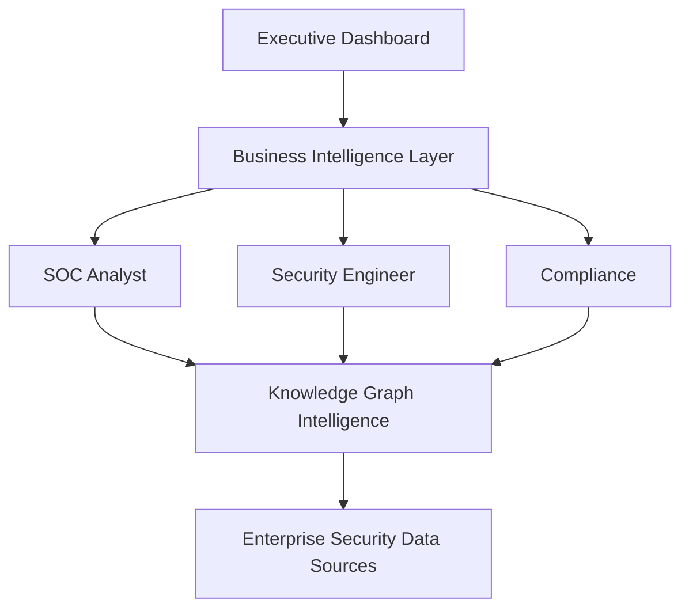

This role-centric design ensures that every stakeholder receives information relevant to their responsibilities without losing the contextual relationships that underpin enterprise cyber risk.

---

# 7. System Architecture
SentinelAI follows a layered, event-driven, AI-assisted enterprise architecture designed to ingest heterogeneous cybersecurity data, transform it into an interconnected enterprise knowledge graph, evaluate contextual cyber risk using deterministic analytics, and augment results with explainable AI. Each architectural layer has a well-defined responsibility, enabling modular development, independent scalability, and simplified maintenance.

Unlike traditional security platforms that centralize logs or dashboards, SentinelAI centers its architecture around the **Enterprise Knowledge Graph**, which acts as the system’s contextual intelligence backbone. Surrounding this core are specialized ingestion, analytics, AI, governance, and presentation services.

The architecture intentionally separates deterministic processing (graph analytics, risk computation, policy evaluation) from probabilistic AI processing (summarization, recommendation generation, conversational assistance). This design minimizes AI hallucinations while preserving explainability and trust.

## 7.1 Architecture Overview

### High-Level Architecture
SentinelAI operates as an eight-stage intelligence pipeline that transforms raw enterprise security telemetry into actionable cyber risk intelligence.

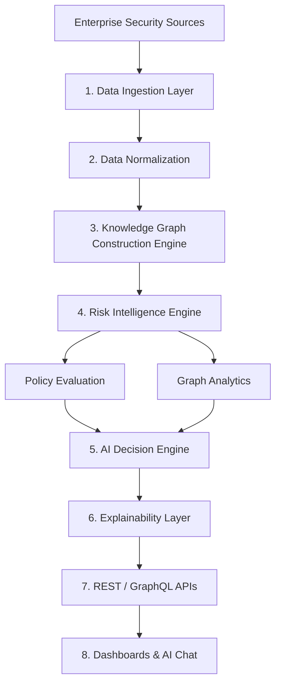

### Stage-by-Stage Architecture

| Stage | Module | Input | Output |
| :--- | :--- | :--- | :--- |
| **Stage 1** | Data Ingestion Layer | Enterprise security tools | Raw security events |
| **Stage 2** | Data Normalization Engine | Raw heterogeneous data | Canonical enterprise entities |
| **Stage 3** | Knowledge Graph Builder | Canonical entities | Connected enterprise graph |
| **Stage 4** | Risk Intelligence Engine | Knowledge Graph | Contextual risk scores |
| **Stage 5** | AI Decision Engine | Verified risk evidence | Recommendations & summaries |
| **Stage 6** | Explainability Layer | AI responses + graph evidence | Explainable recommendations |
| **Stage 7** | API Gateway | Internal intelligence | REST / GraphQL services |
| **Stage 8** | User Applications | APIs | Dashboards, reports, AI assistant |

## 7.2 Component Architecture

### 1. Enterprise Data Ingestion Layer
- **Purpose:** Collects cybersecurity data from multiple enterprise systems and cloud platforms.
- **Responsibilities:**
  - Scheduled connector execution
  - Event-based ingestion
  - API integrations
  - File import
  - Webhook processing
  - Streaming ingestion
- **Typical Integrations:**
  - SIEM platforms
  - Vulnerability scanners
  - Endpoint protection
  - Cloud providers
  - Identity providers
  - CMDB
  - Ticketing systems

### 2. Data Normalization Engine
Enterprise security tools use different schemas. The normalization engine converts heterogeneous data into a unified enterprise data model.

**Entity Normalization Examples:**
- `Azure VM`, `AWS EC2`, `VMware VM` → **Enterprise Asset**
- `Azure AD User`, `Okta User`, `Active Directory User` → **Enterprise Identity**

**Responsibilities:**
- Schema mapping
- Entity resolution
- Duplicate elimination
- Metadata enrichment
- Timestamp normalization
- Risk attribute standardization

### 3. Knowledge Graph Builder
The Knowledge Graph Builder represents the organization’s digital ecosystem. Instead of storing information in isolated tables, entities become graph nodes connected by semantic relationships.

**Example Relationship:**
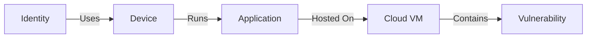

**Major Node Categories:**
- Users, Devices, Servers, Cloud Resources, Applications, APIs, Databases, Vulnerabilities, Compliance Controls, Threat Indicators.

**Relationship Examples:**
- `Owns`, `Uses`, `Connected To`, `Depends On`, `Hosts`, `Contains`, `Exposed To`, `Violates`, `Remediated By`.

### 4. Risk Intelligence Engine
This is the analytical core of SentinelAI. Unlike conventional scoring systems that evaluate isolated findings, this engine performs contextual graph analysis. The engine produces deterministic evidence before any AI reasoning occurs.

**Core Capabilities:**
- Graph traversal
- Attack path analysis
- Risk propagation
- Asset dependency analysis
- Identity privilege evaluation
- Exposure assessment
- Business impact calculation
- Compliance impact evaluation

### 5. AI Decision Intelligence Engine
The AI engine never invents facts. AI operates exclusively within verified enterprise context through **Retrieval-Augmented Generation (RAG)**.

**Consumes:**
- Verified graph evidence
- Risk engine outputs
- Enterprise policies
- Historical incidents
- Compliance mappings

**Performs:**
- Executive summaries
- Analyst recommendations
- Remediation suggestions
- Natural language explanations
- Interactive question answering

### 6. Explainability Engine
One of SentinelAI’s strongest differentiators. This enables analysts to validate every recommendation.

**Every recommendation contains:**
- Supporting graph evidence
- Related assets
- Affected identities
- Compliance mappings
- Risk contributors
- Confidence score
- Reasoning trace

### 7. API Gateway
The API Gateway provides secure access to platform services. Supported interfaces include REST, GraphQL, WebSocket, and Internal Service APIs.

**Responsibilities:**
- Authentication & Authorization
- Rate limiting
- API versioning
- Request validation
- Response transformation
- Audit logging

### 8. User Experience Layer
Provides role-specific experiences. Applications include:
- Executive Dashboard
- Security Operations Dashboard
- Risk Explorer
- Knowledge Graph Visualizer
- AI Chat Assistant
- Compliance Portal
- Report Generator
- Administration Console

## 7.3 Data Flow
The following table illustrates how information flows through SentinelAI.

| Step | Data Movement Description |
| :--- | :--- |
| **1** | Enterprise connectors collect security data from external systems. |
| **2** | Raw events enter the ingestion pipeline. |
| **3** | Data normalization converts heterogeneous schemas into canonical entities. |
| **4** | Duplicate entities are merged through entity resolution. |
| **5** | New entities and relationships are inserted into the Knowledge Graph. |
| **6** | Graph analytics calculate relationships, dependencies, and attack paths. |
| **7** | Risk Intelligence Engine computes contextual organizational risk. |
| **8** | Verified evidence is forwarded to the AI Decision Engine. |
| **9** | RAG retrieves supporting organizational context. |
| **10** | LLM generates explainable recommendations grounded in enterprise evidence. |
| **11** | Explainability Engine attaches evidence, graph relationships, and reasoning traces. |
| **12** | APIs expose intelligence to dashboards and AI assistants. |
| **13** | Dashboards present role-specific cyber risk insights. |

---

# 8. Functional Requirements
The following functional requirements define the core capabilities expected from SentinelAI.

| ID | Requirement | Priority |
| :--- | :--- | :--- |
| **FR-01** | Ingest security data from multiple enterprise sources | Must Have |
| **FR-02** | Normalize heterogeneous security data into a canonical model | Must Have |
| **FR-03** | Build and maintain an enterprise Knowledge Graph | Must Have |
| **FR-04** | Correlate vulnerabilities, identities, assets, and business services | Must Have |
| **FR-05** | Calculate contextual organizational risk scores | Must Have |
| **FR-06** | Generate explainable AI recommendations | Must Have |
| **FR-07** | Provide natural language cyber assistant | Must Have |
| **FR-08** | Support graph exploration and visualization | Must Have |
| **FR-09** | Generate executive cyber risk dashboards | Must Have |
| **FR-10** | Produce compliance evidence reports | Should Have |
| **FR-11** | Support role-based dashboards | Must Have |
| **FR-12** | Provide REST and GraphQL APIs | Must Have |
| **FR-13** | Maintain complete audit history | Must Have |
| **FR-14** | Support enterprise authentication providers | Must Have |
| **FR-15** | Integrate with ticketing systems for remediation workflows | Should Have |
| **FR-16** | Generate downloadable reports (PDF/CSV) | Should Have |
| **FR-17** | Provide real-time notifications for critical risk changes | Could Have |
| **FR-18** | Support multi-tenant deployments | Should Have |
| **FR-19** | Enable customizable risk scoring policies | Should Have |
| **FR-20** | Support plugin-based enterprise connectors | Could Have |

---

# 9. Non-Functional Requirements
SentinelAI must satisfy enterprise-grade quality attributes beyond functional correctness.

| Category | Requirement |
| :--- | :--- |
| **Performance** | Dashboard response time under 2 seconds for standard queries |
| **Scalability** | Support millions of graph nodes and relationships |
| **Security** | End-to-end encryption, RBAC, MFA integration, audit logging |
| **Reliability** | 99.9% service availability for production deployments |
| **Maintainability** | Modular microservice architecture with independent deployments |
| **Portability** | Deployable on public cloud, private cloud, or hybrid infrastructure |
| **Testability** | Automated unit, integration, API, UI, and security testing |
| **Auditability** | Complete traceability of user actions, AI outputs, and system decisions |
| **Availability** | High-availability clustering with automatic failover |
| **Observability** | Centralized logging, distributed tracing, metrics collection |
| **Extensibility** | Plugin architecture for connectors and analytics modules |
| **Compliance** | Support enterprise governance and regulatory requirements |
| **Resilience** | Graceful degradation during service or connector failures |

---

# 10. Technology Stack
The technology stack has been selected to balance enterprise scalability, developer productivity, explainable AI integration, and graph analytics capabilities.

| Layer | Technology | Justification |
| :--- | :--- | :--- |
| **Frontend** | `Next.js` (React + TypeScript) | Modern SSR framework with excellent performance and enterprise ecosystem |
| **UI Components** | `Tailwind CSS` + `shadcn/ui` | Consistent, accessible, and maintainable design system |
| **Backend APIs** | `FastAPI` | High-performance asynchronous API framework with automatic OpenAPI generation |
| **Authentication** | `Keycloak` / `Microsoft Entra ID` | Enterprise identity federation using OAuth2, OIDC, and SAML |
| **API Gateway** | `Kong` or `NGINX` | Centralized routing, authentication, rate limiting, and API governance |
| **Knowledge Graph**| `Neo4j` | Native graph database optimized for relationship traversal and path analysis |
| **Relational DB** | `PostgreSQL` | Structured storage for users, configurations, audit records, and metadata |
| **Cache** | `Redis` | High-speed caching, session management, and background job coordination |
| **Message Broker** | `Apache Kafka` | Event-driven ingestion and asynchronous processing |
| **Object Storage** | `MinIO` or `Amazon S3` | Storage for reports, imported datasets, and generated artifacts |
| **AI Orchestration**| `LangGraph` / `LangChain` | Controlled orchestration of retrieval and LLM interactions |
| **Vector Store** | `pgvector` or `Qdrant` | Efficient semantic retrieval for Retrieval-Augmented Generation (RAG) |
| **Large Language Model**| `GPT-4.x` or `Azure OpenAI` | Natural language reasoning, summarization, and recommendation generation |
| **Graph Analytics** | `Neo4j Graph Data Science` | Graph algorithms for centrality, community detection, and pathfinding |
| **Data Processing** | `Pandas` & `Polars` | Efficient transformation and enrichment of structured datasets |
| **Containerization**| `Docker` | Consistent packaging across environments |
| **Orchestration** | `Kubernetes` | Automated deployment, scaling, and resilience |
| **Monitoring** | `Prometheus` + `Grafana` | Metrics collection, dashboards, and alerting |
| **Logging** | `OpenTelemetry` + `Loki` | Centralized structured logging and distributed tracing |
| **CI/CD** | `GitHub Actions` | Automated testing, builds, and deployments |
| **Infra as Code** | `Terraform` | Reproducible cloud infrastructure provisioning |

---

# 11. Working Mechanism
The Working Mechanism describes how SentinelAI transforms fragmented enterprise security data into explainable cyber risk intelligence. Unlike conventional cybersecurity platforms that primarily collect and display alerts, SentinelAI performs a multi-stage intelligence pipeline where deterministic analytics establish factual evidence before Artificial Intelligence generates human-readable insights.

The complete execution pipeline consists of four major subsystems:
1. Enterprise Data Ingestion & Integration Engine
2. Knowledge Graph & Risk Intelligence Engine
3. AI Decision Intelligence Pipeline
4. Explainability & User Interaction Layer

Each subsystem has clearly defined responsibilities, standardized input/output contracts, and can be independently scaled within the overall enterprise architecture.

## 11.1 Enterprise Data Ingestion & Integration Engine
The Enterprise Data Ingestion Engine serves as SentinelAI’s entry point into the organization’s cybersecurity ecosystem. Its primary objective is to continuously collect security telemetry from multiple heterogeneous sources, normalize the incoming information, and prepare it for graph-based analysis.

Unlike traditional ETL pipelines that merely transfer data, this engine performs **intelligent integration** by resolving entity identities, eliminating duplicates, enriching records with organizational metadata, and converting diverse schemas into a unified enterprise data model.

### Enterprise Connectors
SentinelAI supports multiple connector types to accommodate the diversity of enterprise security infrastructure.

| Connector Type | Examples | Purpose |
| :--- | :--- | :--- |
| **Cloud Security** | AWS Security Hub, Microsoft Defender for Cloud, Google SCC | Cloud asset and posture ingestion |
| **Identity Providers**| Microsoft Entra ID, Okta, Active Directory | Users, roles, privilege relationships |
| **Vulnerability Mgmt**| Nessus, Qualys, Rapid7 | Vulnerability discovery |
| **Endpoint Security** | CrowdStrike, Microsoft Defender, SentinelOne | Endpoint health and security events |
| **SIEM Platforms** | Splunk, Microsoft Sentinel, QRadar | Log aggregation and security incidents |
| **Ticketing Systems** | Jira, ServiceNow | Remediation workflow synchronization |
| **Threat Intel** | MISP, STIX/TAXII feeds | External threat indicators |
| **Asset Inventory** | CMDB, VMware, Kubernetes API | Infrastructure inventory |

### Ingestion Workflow
Each connector follows a standardized lifecycle.

#### Step 1 — Authentication
The connector authenticates securely using OAuth2, API Keys, Service Principals, or Enterprise Identity Federation.

#### Step 2 — Data Collection
Data is retrieved through:
- REST APIs
- Graph APIs
- Event Streams
- Webhooks
- Scheduled synchronization
- Batch imports

#### Step 3 — Schema Validation
Incoming payloads are validated against predefined Pydantic schemas.
> [!NOTE]
> Invalid records are quarantined rather than entering the production intelligence pipeline.

#### Step 4 — Normalization
Different products describe similar entities differently.
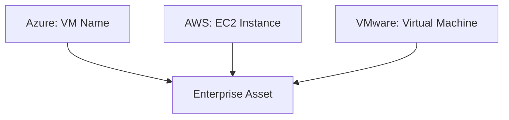

#### Step 5 — Entity Resolution
Duplicate entities are merged. This ensures graph consistency.
```text
Server01
SERVER-01
server01.company.local
↓
Enterprise Asset #142
```

#### Step 6 — Metadata Enrichment
Additional organizational metadata is attached. Examples include:
- Department
- Business Unit
- Asset Criticality
- Environment
- Data Classification
- Compliance Scope
- Owner

#### Step 7 — Event Publication
Normalized entities are published onto the enterprise event bus. These events drive downstream graph updates.
- `AssetUpdated`
- `IdentityCreated`
- `VulnerabilityDetected`
- `ComplianceViolation`
- `PolicyChanged`

### Ingestion Engine Technology

| Technology | Why Used | Responsibility |
| :--- | :--- | :--- |
| **FastAPI** | Enterprise API ingestion | Connector endpoints |
| **Kafka** | Event streaming | Reliable asynchronous processing |
| **Redis Streams** | Lightweight queues | Internal buffering |
| **Pydantic v2** | Schema validation | Payload validation |
| **Celery / Arq** | Background workers | Scheduled synchronization |
| **PostgreSQL** | Metadata persistence | Connector configuration |

## 11.2 Knowledge Graph & Risk Intelligence Engine
This subsystem represents the intellectual core of SentinelAI. Instead of storing cybersecurity findings independently, SentinelAI constructs an enterprise knowledge graph where every entity becomes part of an interconnected security model.

### Graph Construction
Each normalized entity becomes a graph node. Examples include `Identity`, `Device`, `Server`, `Cloud Resource`, `Application`, `Database`, `API`, `Vulnerability`, `Compliance Control`, `Threat Indicator`.

Relationships capture organizational context. Examples: `USES`, `OWNS`, `HOSTS`, `RUNS`, `CONNECTED_TO`, `DEPENDS_ON`, `EXPOSED_TO`, `HAS_VULNERABILITY`, `PROTECTED_BY`, `VIOLATES`.

### Graph Update Lifecycle
Every incoming event updates the graph.
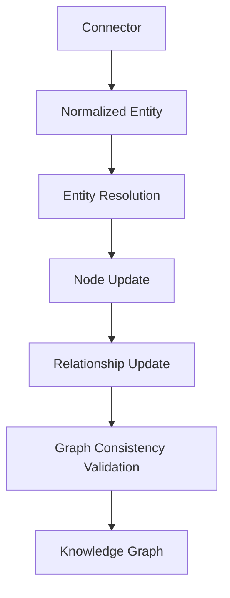

### Graph Analytics
Once the graph has been updated, deterministic algorithms compute organizational intelligence. Major analyses include:

- **Attack Path Analysis:** Determines whether attackers can traverse between assets. (e.g., Internet → Web Server → Application → Database → Crown Jewel Asset)
- **Privilege Escalation Analysis:** Evaluates identity relationships. (e.g., User → Group → Administrator → Critical Server)
- **Dependency Analysis:** Identifies cascading failures. (e.g., Application A → API → Database → Storage → Cloud Infrastructure)
- **Blast Radius Estimation:** Calculates the organizational impact if a node becomes compromised.
- **Compliance Mapping:** Maps graph entities to ISO 27001, NIST CSF, CIS Controls, SOC 2, GDPR.

### Deterministic Risk Engine
The Risk Engine calculates enterprise risk before any AI interaction. Instead of using only CVSS scores, SentinelAI evaluates multiple dimensions.

**Risk Inputs:**
- Vulnerability Severity
- Asset Criticality
- Business Dependency
- Network Exposure
- Identity Privileges
- Threat Intelligence
- Compliance Impact
- Historical Incidents
- Graph Centrality
- Attack Path Reachability

**Risk Evaluation Pipeline:**
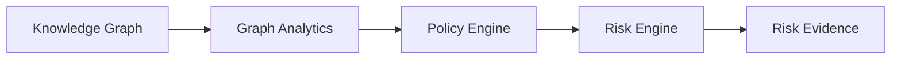

**Risk Output:**
Each finding contains Risk ID, Risk Score, Business Impact, Affected Assets, Related Vulnerabilities, Compliance Impact, Evidence Graph, and Confidence. 
> [!IMPORTANT]
> No AI participates in this stage.

## 11.3 AI Decision Intelligence Pipeline
Once deterministic evidence has been generated, SentinelAI invokes Artificial Intelligence to transform technical findings into understandable organizational intelligence. This strict separation prevents AI hallucinations from influencing factual security analysis.

### Retrieval-Augmented Generation (RAG)
The AI subsystem never reasons over raw prompts alone. Instead, it retrieves verified organizational evidence.
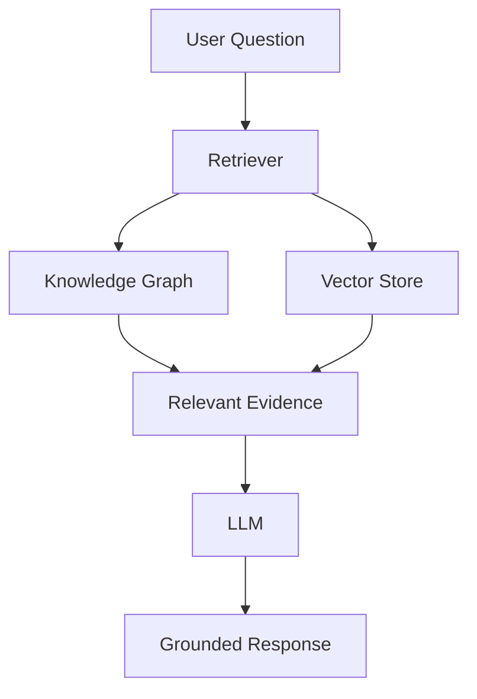

### AI Responsibilities
Artificial Intelligence performs:
- Executive summaries
- Risk explanations
- Analyst guidance
- Remediation recommendations
- Report generation
- Interactive conversations

> [!WARNING]
> It does **not** calculate risk scores.

### Prompt Assembly
The prompt contains:
- Risk Evidence
- Affected Assets
- Graph Relationships
- Compliance Mapping
- Historical Context
- Policies
- Business Metadata

The LLM therefore reasons only within verified enterprise context.

### Explainable Recommendation Generation
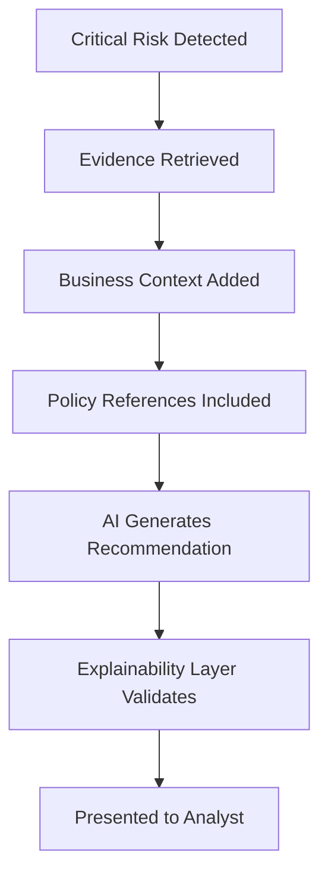

### AI Technology Stack

| Technology | Purpose |
| :--- | :--- |
| **LangGraph** | Agent orchestration |
| **LangChain** | Retrieval pipeline |
| **Azure OpenAI / GPT-4.x** | Natural language reasoning |
| **pgvector / Qdrant** | Semantic retrieval |
| **Neo4j** | Graph evidence retrieval |
| **Redis** | Conversation memory |
| **FastAPI** | AI service endpoints |

## 11.4 End-to-End Runtime Trace
The following scenario demonstrates a complete SentinelAI execution from data ingestion to executive recommendation.

**Scenario:** A new vulnerability is discovered on a production web server hosting a critical customer-facing application.

| Step | Stage | Component | Technology | What Happens |
| :--- | :--- | :--- | :--- | :--- |
| **1** | Data Collection | Vulnerability Connector | REST API | Scanner reports a new CVE |
| **2** | Normalization | Data Normalizer | Pydantic | Converts vendor schema into enterprise format |
| **3** | Entity Resolution | Resolution Engine | PostgreSQL | Matches existing server asset |
| **4** | Graph Update | Neo4j | Cypher | Adds vulnerability relationship |
| **5** | Graph Analytics | Graph Data Science | Neo4j GDS | Recalculates attack paths |
| **6** | Dependency Analysis | Risk Engine | Python | Determines affected business services |
| **7** | Policy Evaluation | Policy Engine | Rule Engine | Identifies compliance impact |
| **8** | Risk Scoring | Deterministic Engine | Python | Produces contextual organizational risk |
| **9** | Context Retrieval | RAG | Neo4j + Vector Store | Retrieves graph evidence |
| **10** | Recommendation Gen | GPT-4.x | LangGraph | Creates explainable remediation guidance |
| **11** | Validation | Explainability Engine | Python | Attaches graph evidence and confidence |
| **12** | API Layer | FastAPI | REST | Delivers structured intelligence |
| **13** | Dashboard | Next.js | React | Analyst views graph visualization |
| **14** | Executive Dashboard | BI Layer | Charts | Executive risk posture updates automatically |

---

# 12. AI / ML Components
SentinelAI employs Artificial Intelligence selectively, ensuring that deterministic graph analytics and policy evaluation establish factual evidence before AI generates recommendations. This "AI-after-evidence" approach minimizes hallucinations and maximizes trust.

| Component | Model / Approach | Purpose | Output Contract |
| :--- | :--- | :--- | :--- |
| **Executive Summary Generator** | GPT-4.x / Azure OpenAI | Summarize enterprise cyber posture | Executive-ready narrative grounded in verified evidence |
| **Risk Explanation Engine** | Retrieval-Augmented Generation (RAG) | Explain why a risk is significant | Natural language explanation with graph citations |
| **Remediation Advisor** | LLM + Policy Context | Recommend remediation actions | Ranked remediation steps with confidence and rationale |
| **Conversational Security Assistant** | LangGraph + LLM | Answer analyst questions | Context-aware responses restricted to enterprise data |
| **Compliance Narrative Generator** | LLM + Compliance Knowledge | Produce audit-ready documentation | Structured compliance summaries linked to controls |
| **Report Generator** | LLM | Convert technical findings into executive reports | PDF/Markdown-ready reports |
| **Semantic Retrieval** | Vector Search (pgvector/Qdrant) | Retrieve relevant organizational knowledge | Ranked evidence snippets for prompt assembly |

### AI Design Principle
SentinelAI deliberately separates deterministic processing from AI reasoning.
- **Deterministic logic** handles data ingestion, graph construction, relationship analysis, risk scoring, policy evaluation, and compliance mapping.
- **AI** is invoked only after deterministic evidence has been established, using Retrieval-Augmented Generation (RAG) to generate explanations, recommendations, summaries, and conversational responses grounded in verified enterprise context.

This hybrid architecture ensures that AI enhances analyst productivity without compromising the integrity or traceability of cybersecurity decisions.

---

# 13. Security Architecture
SentinelAI is designed as an enterprise-grade cybersecurity platform where security is embedded into every architectural layer rather than implemented as an afterthought. Since the platform processes highly sensitive organizational assets, vulnerabilities, identities, compliance evidence, and AI-generated recommendations, its security architecture follows **Zero Trust principles**, ensuring every request, user, service, and API interaction is authenticated, authorized, encrypted, monitored, and auditable.

The security model combines identity-based access control, secure communication, encrypted storage, policy enforcement, AI safety mechanisms, and comprehensive auditability to protect both enterprise data and the intelligence generated by the platform.

## 13.1 Security Architecture Overview
Every request passes through multiple security checkpoints before accessing business logic.

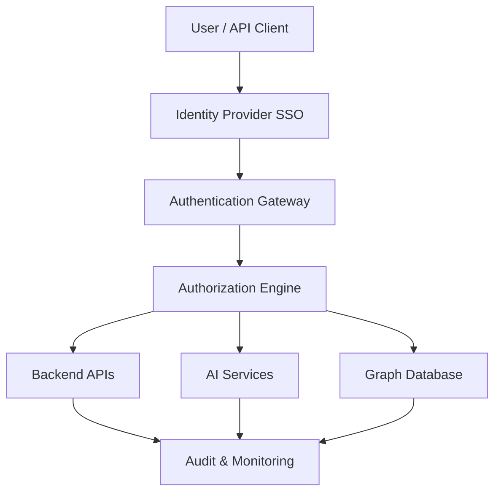

## Authentication
Authentication verifies the identity of every human user, service account, API consumer, and AI subsystem interacting with SentinelAI. Enterprise organizations typically already operate centralized identity providers. SentinelAI integrates with these providers rather than introducing another authentication mechanism.

### Supported Authentication Methods

| Authentication Method | Purpose |
| :--- | :--- |
| **OAuth 2.0** | Secure delegated authorization |
| **OpenID Connect (OIDC)** | Enterprise Single Sign-On |
| **SAML 2.0** | Corporate identity federation |
| **Microsoft Entra ID** | Enterprise identity integration |
| **Keycloak** | Self-hosted identity provider |
| **Okta** | Cloud Identity Provider |
| **LDAP / Active Directory** | Enterprise directory services |
| **Multi-Factor Auth (MFA)** | Additional login verification |

### Authentication Flow
JWT access tokens are validated on every request.
`User Login → Identity Provider → JWT Token Issued → API Gateway Validation → Backend Services → Authorized Session`

## Authorization
Authentication answers: *"Who are you?"*  
Authorization answers: *"What are you allowed to do?"*  
SentinelAI implements multiple authorization layers.

### Role-Based Access Control (RBAC)
Primary enterprise roles include:
- **Super Administrator:** Complete platform management
- **Security Administrator:** Manage users, connectors, policies
- **SOC Analyst:** Investigate risks and incidents
- **Security Engineer:** View vulnerabilities and remediation
- **Compliance Officer:** Compliance dashboards and reports
- **Executive:** Read-only executive dashboards
- **Auditor:** Historical evidence and audit logs
- **AI Assistant:** Read-only contextual enterprise knowledge

### Attribute-Based Access Control (ABAC)
RBAC alone is insufficient for large enterprises. ABAC evaluates additional attributes such as Department, Business Unit, Asset Owner, Country, Compliance Zone, Clearance Level, and Project Assignment.

**Example policy:**
```text
Allow access if:
Department == Security
AND Business Unit == Finance
AND Classification <= Confidential
```

### API Authorization
Every REST and GraphQL endpoint verifies:
- JWT validity
- User role
- Tenant
- Resource ownership
- Requested operation
- API scope

Unauthorized requests never reach business logic.

## Data Protection
SentinelAI stores sensitive organizational information requiring multiple protection layers.

### Encryption at Rest

| Storage | Encryption |
| :--- | :--- |
| **PostgreSQL** | AES-256 Transparent Data Encryption |
| **Neo4j** | Encrypted filesystem volumes |
| **Object Storage** | Server-side encryption |
| **Redis** | Encrypted persistence |
| **Backups** | AES-256 encrypted archives |

### Encryption in Transit
All communication uses:
- TLS 1.3
- HTTPS
- Secure WebSockets
- Mutual TLS (internal services)

### Secrets Management
Secrets are never hardcoded. Managed using HashiCorp Vault, Azure Key Vault, AWS Secrets Manager, or Kubernetes Secrets. Managed secrets include API Keys, Database Passwords, OAuth Credentials, Encryption Keys, and AI Provider Keys.

## AI Security Controls
Because SentinelAI incorporates Large Language Models, additional AI-specific security controls are required.

### Prompt Injection Protection
User prompts are validated before reaching the LLM. Protection includes:
- Prompt sanitization
- Context isolation
- System prompt enforcement
- Content filtering
- Context boundary validation

### Retrieval Guardrails
The AI only receives verified graph evidence, approved documents, and authorized organizational context. The AI cannot retrieve unauthorized enterprise information.

### Hallucination Reduction
SentinelAI minimizes hallucinations through Retrieval-Augmented Generation (RAG), Knowledge Graph evidence, deterministic risk engine, confidence scoring, and explainability validation.

### AI Output Validation
Before AI responses reach users:
`LLM Output → Evidence Validation → Policy Validation → Confidence Evaluation → Response Delivery`
Responses failing validation are rejected.

## Audit Logging
Every significant platform activity is recorded (Login events, Graph updates, Risk calculations, AI conversations, Policy changes, User actions, Administrative changes, Connector synchronization). Audit logs are immutable.

## Security Monitoring
SentinelAI continuously monitors Failed login attempts, API abuse, Privilege escalation, Suspicious AI usage, Unauthorized graph access, and Data exfiltration attempts.

### Additional Security Controls

| Control | Implementation |
| :--- | :--- |
| **Zero Trust Architecture** | Continuous authentication and verification |
| **Rate Limiting** | API Gateway throttling |
| **Input Validation** | Pydantic validation across services |
| **Output Encoding** | Prevent injection attacks |
| **CSP Headers** | Browser security |
| **CSRF Protection** | Stateful web sessions |
| **Secure Cookies** | HTTPOnly, Secure, SameSite |
| **Dependency Scanning** | Dependabot, Trivy |
| **Container Security** | Distroless images, image signing |
| **Runtime Protection** | Falco runtime monitoring |
| **Network Policies** | Kubernetes network isolation |
| **Database Least Privilege**| Restricted service accounts |
| **Immutable Audit Logs** | Append-only storage |

---

# 14. Scalability & Performance
SentinelAI is designed to support enterprise deployments ranging from thousands to millions of interconnected assets while maintaining low response latency and high system availability.

The architecture follows horizontal scalability principles, ensuring individual services can be independently replicated as workload increases.

## Scalability Strategy

### Horizontal Service Scaling
All backend services are stateless. Examples: API Service, AI Service, Risk Engine, Graph API, Dashboard Backend. Each service can scale independently using Kubernetes.

### Event-Driven Processing
Rather than executing everything synchronously, SentinelAI uses asynchronous event processing.
`Connector → Kafka Topic → Consumers → Graph Update → Risk Evaluation`

**Benefits:**
- Higher throughput
- Fault isolation
- Retry support
- Independent scaling

### Graph Scalability
Neo4j supports:
- Millions of nodes
- Tens of millions of relationships
- Index-based traversal
- Relationship caching
- Graph partitioning (future)

### AI Scalability
LLM requests are isolated. Queue-based execution prevents overload. High-cost requests are prioritized. Caching reduces repeated inference.

### Performance Optimizations
- Redis caching
- API response caching
- Graph query optimization
- Cypher indexing
- Batch graph updates
- Parallel ingestion
- Connection pooling
- Lazy loading

## Scalability & Performance Table

| Dimension | Strategy |
| :--- | :--- |
| **API Scaling** | Kubernetes Horizontal Pod Autoscaler |
| **Graph Scaling** | Neo4j clustering |
| **AI Scaling** | Independent AI inference service |
| **Event Processing** | Kafka consumer groups |
| **Database Scaling** | PostgreSQL replication |
| **Cache Scaling** | Redis Cluster |
| **Storage Scaling** | Object Storage |
| **Search Scaling** | Vector index partitioning |
| **High Availability** | Multi-node deployment |
| **Disaster Recovery** | Automated backups and cross-region replication |

## Expected Performance Targets

| Metric | Target |
| :--- | :--- |
| **Dashboard Load Time** | < 2 seconds |
| **API Response** | < 300 ms (non-AI requests) |
| **Graph Traversal** | < 500 ms for common queries |
| **Risk Recalculation** | < 30 seconds after significant graph updates |
| **AI Recommendation Gen** | < 5 seconds (typical) |
| **Concurrent Users** | 5,000+ |
| **Graph Size** | 10M+ nodes, 100M+ relationships (enterprise scale) |
| **Availability** | ≥ 99.9% |

---

# 15. Database & State Design
SentinelAI uses a **polyglot persistence architecture**, selecting the most appropriate storage technology for each workload rather than relying on a single database.

## Data Storage Architecture

| Purpose | Technology |
| :--- | :--- |
| **Operational Data** | PostgreSQL |
| **Knowledge Graph** | Neo4j |
| **Semantic Retrieval** | pgvector / Qdrant |
| **Cache** | Redis |
| **Object Storage** | MinIO / Amazon S3 |
| **Audit Logs** | PostgreSQL + Object Storage |

## Core Data Model

### Relational Models
| Entity | Fields |
| :--- | :--- |
| **User** | User ID (UUID), Name, Email, Role (Enum), Department, Tenant ID (UUID) |
| **Enterprise Asset** | Asset ID (UUID), Asset Name, Asset Type (Enum), Criticality (Int), Owner (UUID), Environment (Enum) |
| **Vulnerability** | Vulnerability ID (UUID), CVE, Severity (Float), Risk Score (Float), Status (Enum) |
| **Identity** | Identity ID (UUID), Username, Privilege Level (Int), MFA Enabled (Boolean) |
| **Risk Record** | Risk ID (UUID), Risk Score (Float), Confidence (Float), Business Impact (Enum), Generated Time (Timestamp) |

### Knowledge Graph Model
- **Node Types:** User, Device, Server, Application, Cloud Resource, API, Database, Vulnerability, Policy, Compliance Control, Threat Indicator.
- **Relationship Types:** USES, OWNS, HOSTS, CONNECTED_TO, DEPENDS_ON, HAS_VULNERABILITY, EXPOSED_TO, VIOLATES, MITIGATED_BY.

## Runtime State
Short-lived execution state is maintained in Redis for: AI conversations, Connector synchronization, Job queues, Workflow execution, Cached graph queries.

---

# 16. API Design
SentinelAI follows an **API-first architecture**, enabling integration with enterprise applications, security tools, automation platforms, and custom workflows.

The platform exposes REST APIs for operational functionality and GraphQL for flexible data exploration.

## Core API Categories

| Category | Purpose |
| :--- | :--- |
| **Authentication** | User login and token management |
| **Assets** | Asset inventory and management |
| **Vulnerabilities**| Security findings |
| **Knowledge Graph**| Graph queries and visualization |
| **Risk Intelligence**| Risk scores and analysis |
| **AI Assistant** | Conversational security interface |
| **Compliance** | Regulatory reporting |
| **Administration** | Users, roles, connectors |

## Representative REST Endpoints

| Endpoint | Method | Purpose |
| :--- | :--- | :--- |
| `/api/auth/login` | POST | Authenticate user |
| `/api/assets` | GET | List enterprise assets |
| `/api/assets/{id}` | GET | Retrieve asset details |
| `/api/vulnerabilities` | GET | Query vulnerabilities |
| `/api/graph/search` | POST | Search the knowledge graph |
| `/api/risks` | GET | Retrieve organizational risks |
| `/api/risk/{id}` | GET | Retrieve risk details |
| `/api/ai/chat` | POST | AI security assistant |
| `/api/reports` | POST | Generate reports |
| `/api/compliance` | GET | Compliance posture |
| `/api/connectors` | GET | Connector management |
| `/api/connectors/sync` | POST | Trigger synchronization |

## GraphQL Example
GraphQL supports complex relationship queries such as:
```graphql
query {
  asset(id: "123") {
    name
    vulnerabilities {
      cve
      severity
    }
    connectedAssets {
      name
      riskScore
    }
  }
}
```

## API Security
Every endpoint enforces:
- OAuth2 / OIDC authentication
- RBAC and ABAC authorization
- Request validation
- Rate limiting
- Audit logging
- Versioning (`/v1`, `/v2`)
- OpenAPI documentation

---

# 17. Deployment Architecture
SentinelAI is designed as a cloud-native enterprise platform capable of operating across on-premises, hybrid cloud, and multi-cloud environments. The deployment architecture emphasizes high availability, fault tolerance, scalability, security, and operational simplicity while remaining flexible enough for organizations with varying infrastructure requirements.

Unlike monolithic cybersecurity platforms, SentinelAI adopts a microservices architecture where individual services can be independently deployed, updated, and scaled without affecting the overall platform.

## 17.1 Deployment Philosophy
The deployment strategy follows five guiding principles:
1. Cloud-native by design
2. Stateless application services
3. Containerized workloads
4. Infrastructure as Code (IaC)
5. Zero-downtime deployments

## 17.2 Environment Architecture

| Environment | Configuration | Purpose |
| :--- | :--- | :--- |
| **Development** | Docker Compose, Local PostgreSQL, Neo4j, Redis | Individual developer environment |
| **Integration Testing**| Kubernetes + Mock Security Connectors | Automated testing and validation |
| **Staging** | Production-equivalent infra with sanitized datasets | User Acceptance Testing (UAT) |
| **Production** | Kubernetes Cluster with High Availability | Enterprise production workloads |
| **Disaster Recovery** | Secondary Region Deployment | Business continuity and failover |

## 17.3 Production Topology
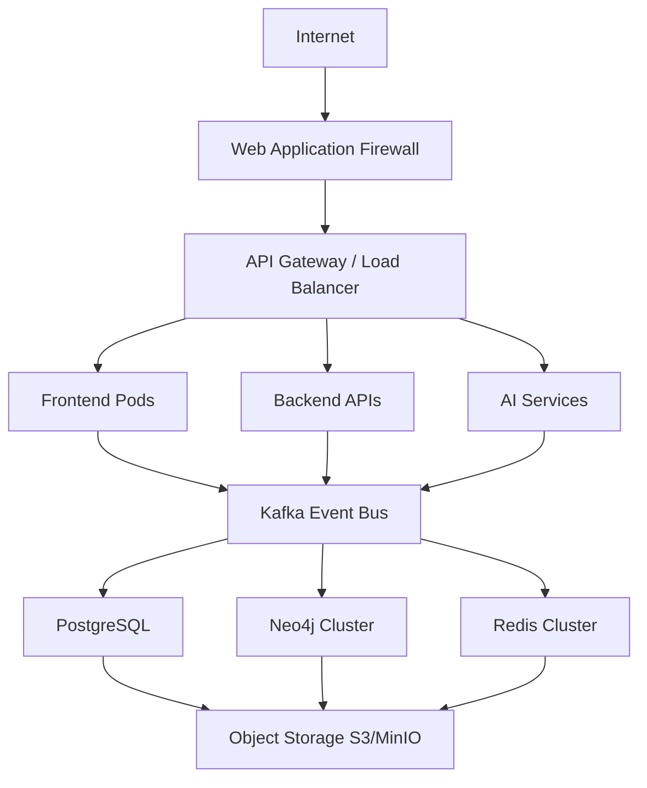

## 17.4 Containerization Strategy
Every SentinelAI component is packaged as an independent Docker image.

**Core Containers:**
Frontend, API Gateway, Authentication Service, Connector Service, Risk Engine, Knowledge Graph Service, AI Service, Report Generator, Notification Service, Background Worker.

**Benefits include:**
Independent deployment, Version isolation, Simplified rollback, Platform portability, Consistent environments.

## 17.5 Kubernetes Deployment
Kubernetes provides Auto scaling, Rolling updates, Self-healing, Service discovery, Configuration management, Secret management, Health monitoring.

**Major Kubernetes resources include:**
Deployments, Services, ConfigMaps, Secrets, Horizontal Pod Autoscalers, Ingress Controllers, Persistent Volume Claims.

## 17.6 CI/CD Pipeline
Continuous delivery ensures safe and repeatable deployments.

`Developer Commit → GitHub Actions → Unit Testing → Security Scanning → Docker Build → Integration Testing → Deployment to Staging → User Acceptance Testing → Production Release`

## 17.7 Infrastructure as Code
Infrastructure is provisioned using Terraform.
**Managed resources include:** Kubernetes Cluster, PostgreSQL, Neo4j, Redis, Object Storage, Networking, IAM, Monitoring Stack, Secrets Management.

## 17.8 Deployment Best Practices
- Blue-Green Deployments
- Canary Releases
- Feature Flags
- Automatic Rollback
- Immutable Infrastructure
- Automated Database Migrations
- Continuous Security Validation

---

# 18. Monitoring & Observability
Enterprise cybersecurity platforms require continuous visibility into both operational health and business processes. SentinelAI incorporates comprehensive observability across infrastructure, services, AI workloads, graph processing, and user interactions.

Observability enables proactive issue detection, performance optimization, and audit readiness.

## 18.1 Observability Architecture
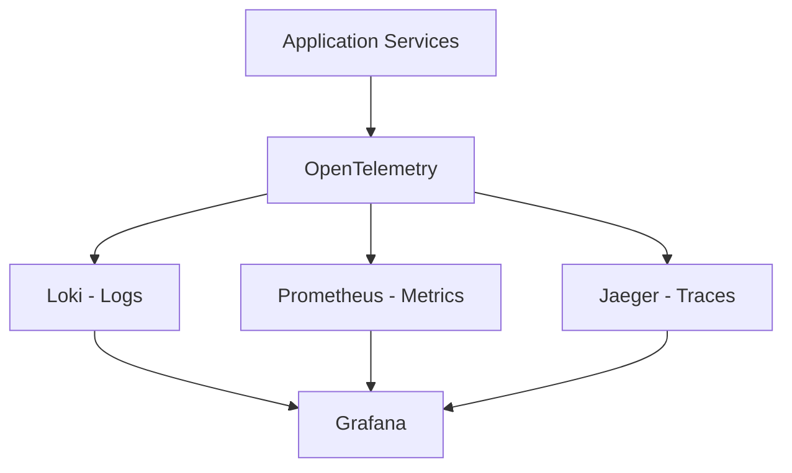

## 18.2 Logging
Every service emits structured JSON logs.
**Log categories include:** Authentication, Connector synchronization, Graph updates, AI interactions, API requests, Risk calculations, Compliance reports, Administrative actions.

## 18.3 Metrics
**Key platform metrics include:** API latency, Connector throughput, Kafka queue depth, Graph update frequency, AI inference latency, Risk calculation duration, Dashboard response time, User activity, Database performance.

## 18.4 Distributed Tracing
Each request receives a unique trace identifier, enabling rapid troubleshooting.
`User Login → Dashboard Request → Graph Query → Risk Engine → AI Service → API Response`

## 18.5 Alerting
Automated alerts trigger when: API latency exceeds threshold, Connector failures occur, Graph updates fail, AI service becomes unavailable, Database replication stops, Kubernetes pods crash, Authentication anomalies appear.

## 18.6 Monitoring Matrix

| Layer | Tool / Approach |
| :--- | :--- |
| **Infrastructure** | Prometheus Node Exporter |
| **Kubernetes** | kube-state-metrics |
| **Application Logs** | Loki |
| **Metrics** | Prometheus |
| **Dashboards** | Grafana |
| **Distributed Tracing** | OpenTelemetry + Jaeger |
| **AI Monitoring** | LangSmith / OpenTelemetry |
| **Security Monitoring**| Falco |
| **Database Monitoring**| PostgreSQL Exporter |
| **Neo4j Monitoring** | Neo4j Metrics Plugin |

---

# 19. Risks & Mitigation
Every enterprise platform faces technical, operational, and business risks. SentinelAI incorporates proactive mitigation strategies to minimize their impact.

| Risk | Probability | Impact | Mitigation |
| :--- | :--- | :--- | :--- |
| **Connector API changes** | Medium | High | Versioned connectors and automated compatibility tests |
| **AI hallucinations** | Medium | High | RAG, deterministic validation, explainability engine |
| **Knowledge Graph inconsistency**| Low | High | Graph validation and transactional updates |
| **Database growth** | High | Medium | Partitioning, indexing, archival strategies |
| **Performance degradation** | Medium | High | Horizontal scaling, caching, query optimization |
| **Unauthorized access** | Low | Critical | RBAC, ABAC, MFA, Zero Trust |
| **Cloud service outage** | Medium | High | Multi-region deployment and failover |
| **Data corruption** | Low | Critical | Automated backups and integrity validation |
| **3rd-party integration failure** | Medium | Medium | Retry mechanisms and graceful degradation |
| **Regulatory changes** | Medium | Medium | Modular compliance mapping framework |
| **AI provider downtime** | Medium | Medium | Multi-model support and local fallback models |
| **Insider threats** | Low | High | Audit logging, least privilege, behavioral monitoring |

---

# 20. Competitive Analysis & USP
The enterprise cybersecurity market contains numerous specialized solutions. SentinelAI differentiates itself by combining graph intelligence, deterministic risk evaluation, and explainable AI into a unified decision intelligence platform.

## Competitive Analysis

| Solution Category | Approach | Limitation Compared to SentinelAI |
| :--- | :--- | :--- |
| **SIEM Platforms** | Log aggregation and correlation | Limited business context and relationship modeling |
| **SOAR Platforms** | Workflow automation | Depends on predefined playbooks rather than contextual intelligence |
| **Vulnerability Management** | CVSS-based prioritization | Weak understanding of organizational relationships |
| **CSPM Solutions** | Cloud posture assessment | Limited cross-domain visibility |
| **GRC Platforms** | Governance documentation | Weak operational security intelligence |
| **Security Dashboards** | Visualization | Limited explainability and contextual analytics |
| **AI Security Assistants** | Natural language summaries | Often lack deterministic evidence and graph context |
| **SentinelAI** | Knowledge Graph + Deterministic Risk Engine + Explainable AI | **Unified contextual cyber decision intelligence** |

## Unique Selling Proposition (USP)
SentinelAI distinguishes itself through several key innovations:
- **Enterprise Knowledge Graph:** Models organizational assets, identities, vulnerabilities, applications, cloud resources, and compliance controls as an interconnected graph rather than isolated records.
- **Hybrid Intelligence Architecture:** Deterministic graph analytics establish factual evidence before AI generates recommendations, improving trust and reducing hallucinations.
- **Explainable AI:** Every recommendation includes supporting graph relationships, evidence, and confidence scores.
- **Business-Aware Risk Prioritization:** Risk is evaluated using technical severity, business criticality, exposure, dependencies, and compliance impact rather than CVSS alone.
- **Unified Intelligence Layer:** Enhances existing security investments instead of replacing them.
- **Cloud-Native Enterprise Architecture:** Built for scalability, resilience, and integration within modern enterprise environments.

---

# 21. Implementation Roadmap
The SentinelAI implementation roadmap follows an incremental approach, delivering value early while enabling progressive expansion toward a comprehensive cyber decision intelligence platform.

| Phase | Duration | Deliverables |
| :--- | :--- | :--- |
| **Phase 1 – Foundation** | 4 Weeks | Core UI, authentication, PostgreSQL, Neo4j setup, connector framework, basic dashboards |
| **Phase 2 – Intelligence Core** | 5 Weeks | Knowledge Graph construction, graph analytics, deterministic risk engine, graph visualization |
| **Phase 3 – AI Integration** | 4 Weeks | RAG pipeline, AI assistant, explainability engine, recommendation generation |
| **Phase 4 – Enterprise Features** | 5 Weeks | Compliance mapping, executive dashboards, reporting, multi-tenancy, advanced RBAC |
| **Phase 5 – Production Hardening** | Ongoing | Kubernetes deployment, monitoring, optimization, security hardening, disaster recovery |

## Long-Term Product Evolution

| Version | Capability |
| :--- | :--- |
| **V1** | Unified Cyber Risk Dashboard |
| **V2** | Predictive Risk Analytics |
| **V3** | AI-Assisted Security Operations |
| **V4** | Autonomous Cyber Decision Intelligence |
| **V5** | Enterprise Cyber Digital Twin |

---

# 22. Success Metrics (KPIs)
SentinelAI’s success is measured through operational efficiency, platform performance, AI quality, and business impact.

| Metric | Target | Measurement Method |
| :--- | :--- | :--- |
| **Mean Time to Investigate (MTTI)** | Reduce by ≥40% | SOC operational metrics |
| **Mean Time to Respond (MTTR)** | Reduce by ≥30% | Incident response analytics |
| **Alert Noise Reduction** | ≥50% | Alert correlation analysis |
| **Graph Coverage** | ≥95% of enterprise assets | Graph completeness metrics |
| **AI Recommendation Accuracy** | ≥90% analyst acceptance | User feedback and validation |
| **Dashboard Response Time** | <2 seconds | Prometheus metrics |
| **API Availability** | ≥99.9% | Uptime monitoring |
| **Risk Recalculation Time** | <30 seconds | Risk engine metrics |
| **Connector Reliability** | ≥99% successful syncs | Connector health metrics |
| **Compliance Report Generation**| <60 seconds | Report execution metrics |
| **User Satisfaction** | ≥4.5/5 | User surveys |
| **Deployment Success Rate** | ≥99% | CI/CD analytics |

---

# 23. Conclusion
Modern enterprise cybersecurity is no longer constrained by a lack of security tools; instead, organizations face the challenge of integrating vast amounts of fragmented information into meaningful, actionable intelligence. Security teams must correlate vulnerabilities, identities, cloud resources, business services, compliance controls, and threat intelligence across diverse systems while responding rapidly to an evolving threat landscape.

SentinelAI addresses this challenge by introducing an Enterprise AI-Powered Cyber Risk Intelligence Platform that combines deterministic graph analytics with explainable artificial intelligence. Through continuous data ingestion, enterprise knowledge graph construction, contextual risk evaluation, and evidence-based AI recommendations, the platform transforms isolated technical findings into business-aligned cyber decision intelligence.

The architecture emphasizes transparency, modularity, scalability, and security. By separating deterministic reasoning from AI-generated explanations, SentinelAI minimizes hallucinations while maintaining analyst trust and regulatory traceability. Its cloud-native deployment model, API-first design, comprehensive observability, and extensible connector framework ensure long-term adaptability within modern enterprise environments.

Rather than replacing existing cybersecurity investments, SentinelAI amplifies their value by serving as a unified intelligence layer capable of delivering contextual insights, accelerating investigations, improving compliance readiness, and supporting strategic cybersecurity decision-making. As organizations continue to expand their digital ecosystems, SentinelAI provides a technically feasible, business-relevant, and future-ready foundation for enterprise cyber resilience.

### Architecture Summary
| Dimension | Summary |
| :--- | :--- |
| **Problem** | Fragmented security data, manual risk correlation, limited contextual intelligence |
| **Solution** | Enterprise Knowledge Graph combined with deterministic analytics and explainable AI |
| **Core Innovation** | Hybrid Intelligence Architecture integrating graph analytics, policy evaluation, RAG, and LLMs |
| **Business Value** | Faster investigations, improved risk prioritization, enhanced compliance, executive visibility |
| **Technical Feasibility** | Built using mature, enterprise-proven technologies with cloud-native deployment |
| **Scalability** | Horizontally scalable microservices supporting large enterprise environments |
| **Security** | Zero Trust architecture with enterprise authentication, authorization, encryption, and auditability |
| **Market Position** | Contextual cyber decision intelligence platform complementing existing security investments |
| **Future Vision** | Evolve toward predictive, autonomous, and digital twin–based cyber intelligence ecosystems |

---

# ADDENDUM: How SentinelAI Works (Stage-by-Stage)

**Stage-by-Stage Technical Architecture & Implementation Guide**  
*Companion to: SentinelAI — Enterprise AI-Powered Cyber Risk Intelligence & Governance Platform Architecture & Design Document v1.0*

## Pipeline Overview
SentinelAI executes as an eight-stage intelligence pipeline. Unlike conventional cybersecurity dashboards that simply aggregate security events, SentinelAI progressively transforms raw enterprise telemetry into contextual, explainable cyber intelligence through deterministic graph analytics followed by AI-assisted reasoning.

Each stage has a single responsibility, a well-defined input/output contract, and can be independently developed, deployed, monitored, and scaled.

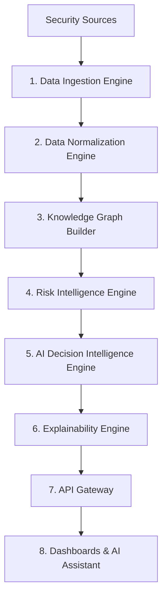

### Stage Summary Reference

| Stage | Name | Role | Core Technology | Input | Output | Est. LOC |
| :--- | :--- | :--- | :--- | :--- | :--- | :--- |
| **1** | Data Ingestion Engine | Collect enterprise security data | FastAPI, Kafka | Security Sources | Security Events | ~350 |
| **2** | Data Normalization Engine | Build canonical enterprise model | Python, Pydantic | Raw Events | Canonical Entities | ~450 |
| **3** | Knowledge Graph Builder | Construct enterprise relationships | Neo4j, Cypher | Entities | Knowledge Graph | ~500 |
| **4** | Risk Intelligence Engine | Deterministic cyber risk evaluation| Neo4j GDS, Python| Graph | Risk Evidence | ~700 |
| **5** | AI Decision Intelligence | AI reasoning over verified evidence | LangGraph, GPT-4.x | Risk Evidence | Recommendations | ~500 |
| **6** | Explainability Engine | Validate AI output & attach evidence | Python | AI Output | Verified Responses | ~300 |
| **7** | API Gateway | Secure service exposure | FastAPI | Service Requests | API Responses | ~250 |
| **8** | Dashboards & AI Assistant| Visualization and interaction | Next.js, React | API Responses | User Interface | ~800 |
---

# STAGE 1

# ENTERPRISE DATA INGESTION ENGINE

**Continuously collect enterprise cybersecurity data from multiple security platforms and transform it into a reliable stream of validated security events for downstream processing.**

The Enterprise Data Ingestion Engine is the entry point of SentinelAI. Its primary responsibility is to continuously collect cybersecurity information from various enterprise security systems such as vulnerability scanners, identity providers, endpoint protection platforms, cloud security services, SIEM solutions, firewalls, and asset management systems.

Since every organization uses different security products, this stage provides a unified data collection layer that abstracts vendor-specific integrations. It securely connects to external systems using APIs, webhooks, or scheduled synchronization jobs, validates incoming data, removes duplicate events, enriches records with basic metadata, and publishes validated security events to the next stage.

This stage does **not perform security analysis or risk assessment**. Its sole responsibility is to ensure that accurate, complete, and reliable security data continuously enters the SentinelAI intelligence pipeline.

---

# Engine Components

| Component                       | Responsibility                                                                                                                                                                 |
| ------------------------------- | ------------------------------------------------------------------------------------------------------------------------------------------------------------------------------ |
| **Connector Manager**           | Manages all configured enterprise security connectors and maintains connector configurations, schedules, and connection status.                                                |
| **Authentication Manager**      | Authenticates with external security platforms using API Keys, OAuth tokens, service accounts, or certificates while securely managing credential refresh.                     |
| **Scheduler**                   | Executes periodic synchronization jobs based on configured polling intervals and connector schedules.                                                                          |
| **Webhook Listener**            | Receives real-time security events pushed from external systems without polling.                                                                                               |
| **Data Collector**              | Retrieves vulnerabilities, alerts, identities, assets, cloud findings, compliance information, and endpoint telemetry from connected security platforms.                       |
| **Payload Validator**           | Validates schema structure, mandatory fields, timestamps, event integrity, and data completeness before processing.                                                            |
| **Duplicate Detection Engine**  | Detects duplicate events using event identifiers, timestamps, and source metadata to prevent redundant processing.                                                             |
| **Metadata Enrichment Service** | Attaches connector metadata, tenant information, collection timestamps, and source identifiers to every incoming event.                                                        |
| **Event Publisher**             | Packages validated security events into a standardized ingestion format and forwards them to the Enterprise Data Normalization Engine through the internal messaging pipeline. |

---

# Data Ingestion Lifecycle

| Step  | Action                  | Implementation Detail                                                                                                                                                |
| ----- | ----------------------- | -------------------------------------------------------------------------------------------------------------------------------------------------------------------- |
| **1** | Load Connector          | Read connector configuration, authentication details, polling schedule, and endpoint information from the connector registry.                                        |
| **2** | Authenticate            | Establish a secure connection with the external security platform using the configured authentication mechanism.                                                     |
| **3** | Collect Security Data   | Retrieve new security events, vulnerabilities, asset information, user identities, alerts, and compliance findings using REST APIs or receive them through webhooks. |
| **4** | Validate Payload        | Verify that incoming records contain mandatory fields, valid timestamps, correctly formatted data, and complete event information.                                   |
| **5** | Detect Duplicate Events | Compare incoming event identifiers against previously processed records and discard duplicate events.                                                                |
| **6** | Enrich Metadata         | Attach source information, connector name, organization identifier, collection timestamp, and ingestion metadata to each event.                                      |
| **7** | Publish Event           | Convert validated records into SentinelAI ingestion events and publish them to the Enterprise Data Normalization Engine.                                             |
| **8** | Schedule Next Execution | Wait for the next polling cycle or continue listening for incoming webhook events.                                                                                   |

---

# Internal Workflow

```text
Load Connector Configuration
            │
            ▼
Authenticate Security Platform
            │
            ▼
Collect Security Data
            │
            ▼
Validate Incoming Payload
            │
            ▼
Detect Duplicate Events
            │
            ▼
Enrich Event Metadata
            │
            ▼
Publish Validated Security Event
            │
            ▼
Forward to Enterprise Data Normalization Engine
```

---

# Example Execution

Suppose an organization has integrated the following security platforms with SentinelAI:

* Microsoft Defender for Endpoint
* CrowdStrike Falcon
* AWS Security Hub
* Active Directory
* Nessus Vulnerability Scanner

The execution begins when the Scheduler activates the configured connectors. The Authentication Manager establishes secure connections with each platform using stored credentials. The Data Collector then retrieves newly generated endpoint alerts, vulnerability reports, cloud security findings, user identities, and asset inventory records.

Each collected record is validated by the Payload Validator to ensure it contains all required fields and follows the expected schema. The Duplicate Detection Engine checks whether the event has already been processed by comparing unique event identifiers and timestamps. If the event is new, the Metadata Enrichment Service attaches additional information such as the connector name, organization identifier, and ingestion timestamp.

Finally, the Event Publisher packages the validated event into SentinelAI's internal event format and forwards it to the Enterprise Data Normalization Engine for further processing.

---

# Example Output Event

```json
{
  "connector": "CrowdStrike",
  "event_type": "endpoint_alert",
  "asset_id": "WS-102",
  "severity": "High",
  "timestamp": "2026-07-03T10:42:18Z",
  "tenant_id": "ORG-001",
  "ingested_at": "2026-07-03T10:42:20Z"
}
```

---

# Technology Breakdown

| Technology                  | Why Used                                  | What It Handles                                                                    |
| --------------------------- | ----------------------------------------- | ---------------------------------------------------------------------------------- |
| **Python 3.11+**            | Core implementation language              | Connector execution, scheduling, validation, event processing, metadata enrichment |
| **FastAPI**                 | Lightweight asynchronous API framework    | Webhook endpoints, connector APIs, ingestion services                              |
| **HTTPX**                   | High-performance asynchronous HTTP client | Secure communication with external security platforms and cloud APIs               |
| **Apache Kafka / RabbitMQ** | Distributed messaging platform            | Reliable event streaming between ingestion and normalization stages                |
| **Pydantic**                | Data validation library                   | Schema validation, payload verification, data parsing                              |
| **AsyncIO**                 | Asynchronous task execution               | Concurrent connector execution, webhook handling, and background synchronization   |

---

# Input

The Enterprise Data Ingestion Engine receives raw cybersecurity information from multiple enterprise security sources, including vulnerability scanners, endpoint protection platforms, identity providers, SIEM systems, cloud security services, network devices, firewalls, compliance tools, and asset management platforms.

---

# Output

The output of this stage is a continuous stream of validated and deduplicated enterprise security events enriched with connector metadata and collection information. These events preserve their original vendor-specific structure but are now reliable, authenticated, and ready for transformation.

**Output → Enterprise Data Normalization Engine**

The validated security events are forwarded to the **Enterprise Data Normalization Engine**, where vendor-specific data structures are transformed into SentinelAI's canonical enterprise data model, ensuring that all downstream components operate on a consistent and standardized representation of enterprise security information.

---

# STAGE 2

# ENTERPRISE DATA NORMALIZATION ENGINE

**Transform heterogeneous vendor-specific security data into a unified enterprise data model that provides a consistent representation of assets, users, vulnerabilities, identities, and security events across the organization.**

The Enterprise Data Normalization Engine is responsible for converting the validated security events collected during Stage 1 into a standardized enterprise format. Since every security vendor uses different field names, schemas, data structures, timestamps, and identifiers, this stage eliminates those differences by mapping all incoming records into SentinelAI's Canonical Enterprise Data Model.

Beyond simple schema conversion, this stage also performs data enrichment, identity resolution, asset correlation, timestamp normalization, and business context mapping. The objective is to ensure that every downstream component works with consistent, high-quality enterprise entities instead of vendor-specific records.

By the end of this stage, SentinelAI no longer sees "CrowdStrike assets," "AWS instances," or "Azure devices" as separate objects—it sees them all as standardized enterprise assets connected by a common data model.

---

# Engine Components

| Component                      | Responsibility                                                                                                                      |
| ------------------------------ | ----------------------------------------------------------------------------------------------------------------------------------- |
| **Event Consumer**             | Receives validated security events published by the Enterprise Data Ingestion Engine.                                               |
| **Schema Parser**              | Reads vendor-specific payloads and identifies their structure and field mappings.                                                   |
| **Field Mapping Engine**       | Converts vendor-specific fields into SentinelAI's canonical schema using predefined mapping rules.                                  |
| **Identity Resolution Engine** | Detects and merges duplicate users, devices, and assets that appear across multiple security platforms under different identifiers. |
| **Timestamp Normalizer**       | Converts timestamps from different formats and time zones into a unified UTC format.                                                |
| **Asset Enrichment Service**   | Adds business metadata such as asset owner, department, location, business unit, criticality, and environment.                      |
| **Metadata Enrichment Engine** | Attaches additional organizational context, source information, and normalization metadata to each entity.                          |
| **Canonical Entity Generator** | Creates standardized enterprise entities such as Assets, Users, Applications, Vulnerabilities, Cloud Resources, and Identities.     |
| **Entity Publisher**           | Publishes canonical enterprise entities to the Knowledge Graph Builder for relationship construction.                               |

---

# Data Normalization Lifecycle

| Step  | Action                       | Implementation Detail                                                                                       |
| ----- | ---------------------------- | ----------------------------------------------------------------------------------------------------------- |
| **1** | Receive Security Event       | Consume validated security events from the Enterprise Data Ingestion Engine through the messaging pipeline. |
| **2** | Parse Vendor Schema          | Identify the originating security platform and load the corresponding schema mapping configuration.         |
| **3** | Map Fields                   | Convert vendor-specific fields into SentinelAI's Canonical Enterprise Data Model.                           |
| **4** | Resolve Identities           | Match users, devices, and assets that refer to the same enterprise entity across multiple systems.          |
| **5** | Normalize Data               | Standardize timestamps, severity levels, identifiers, naming conventions, and data formats.                 |
| **6** | Enrich Business Context      | Attach business owner, department, asset criticality, location, cloud account, and organizational metadata. |
| **7** | Generate Enterprise Entities | Convert normalized records into canonical enterprise entities ready for graph construction.                 |
| **8** | Publish Canonical Entities   | Forward standardized enterprise entities to the Enterprise Knowledge Graph Builder.                         |

---

# Internal Workflow

```text
Receive Validated Security Event
                │
                ▼
Identify Source Platform
                │
                ▼
Parse Vendor Schema
                │
                ▼
Map Vendor Fields
                │
                ▼
Resolve Duplicate Identities
                │
                ▼
Normalize Data Format
                │
                ▼
Enrich Business Context
                │
                ▼
Generate Canonical Enterprise Entity
                │
                ▼
Publish to Knowledge Graph Builder
```

---

# Example Execution

Assume SentinelAI receives the following security events from three different security platforms:

**CrowdStrike**

```json
{
  "hostname": "FIN-PC-001",
  "severity": "High"
}
```

**Microsoft Defender**

```json
{
  "deviceName": "FIN-PC-001",
  "riskLevel": "High"
}
```

**AWS Security Hub**

```json
{
  "resource": "i-458923",
  "criticality": "High"
}
```

Although each platform represents assets differently, the Schema Parser identifies the source system and applies the appropriate mapping rules.

The Field Mapping Engine converts all vendor-specific fields into SentinelAI's canonical schema. The Identity Resolution Engine determines that the CrowdStrike device and Microsoft Defender device refer to the same enterprise workstation. The Asset Enrichment Service retrieves additional business information, including the asset owner, department, criticality, and environment.

Finally, the Canonical Entity Generator produces a standardized enterprise asset that can be understood consistently by every downstream component.

---

# Example Canonical Entity

```json
{
  "asset_id": "FIN-PC-001",
  "asset_type": "Workstation",
  "owner": "Finance Department",
  "business_unit": "Finance",
  "criticality": "High",
  "environment": "Production",
  "source_systems": [
    "CrowdStrike",
    "Microsoft Defender"
  ]
}
```

---

# Technology Breakdown

| Technology                  | Why Used               | What It Handles                                                        |
| --------------------------- | ---------------------- | ---------------------------------------------------------------------- |
| **Python 3.11+**            | Core processing engine | Data transformation, enrichment, normalization, identity resolution    |
| **Pydantic**                | Schema validation      | Canonical model validation, field validation, data serialization       |
| **Apache Kafka / RabbitMQ** | Event streaming        | Receives ingestion events and publishes normalized enterprise entities |
| **Redis**                   | High-speed caching     | Stores identity mappings, lookup tables, and enrichment cache          |
| **PostgreSQL**              | Metadata repository    | Stores mapping configurations, asset metadata, and normalization rules |
| **AsyncIO**                 | Concurrent processing  | Parallel normalization of multiple incoming security events            |

---

# Input

The Enterprise Data Normalization Engine receives validated security events generated by the Enterprise Data Ingestion Engine. These events originate from multiple enterprise security platforms and contain vendor-specific schemas, naming conventions, timestamps, and identifiers.

---

# Output

The output of this stage is a collection of standardized enterprise entities represented using SentinelAI's Canonical Enterprise Data Model. Each entity has been normalized, enriched with business context, and correlated with related identities and assets, providing a consistent representation of the organization's cybersecurity environment.

Examples of generated entities include:

* Enterprise Assets
* Users
* Identities
* Applications
* Vulnerabilities
* Cloud Resources
* Network Devices
* Business Services

**Output → Enterprise Knowledge Graph Builder**

The canonical enterprise entities are forwarded to the **Enterprise Knowledge Graph Builder**, where they are transformed into graph nodes and connected through semantic relationships to create the organization's Enterprise Knowledge Graph.


---

# STAGE 3

# ENTERPRISE KNOWLEDGE GRAPH BUILDER

**Construct the Enterprise Knowledge Graph by transforming normalized enterprise entities into an interconnected graph of assets, identities, vulnerabilities, applications, cloud resources, business services, and their relationships, creating a real-time digital twin of the organization's cybersecurity environment.**

The Enterprise Knowledge Graph Builder is responsible for converting standardized enterprise entities into a graph-based representation of the entire organization. Instead of storing cybersecurity data as isolated records in relational tables, this stage models every enterprise object as a graph node and connects related entities through semantic relationships.

The result is a continuously evolving Enterprise Knowledge Graph that accurately represents how users, devices, applications, vulnerabilities, cloud resources, business services, and network infrastructure are interconnected.

This graph becomes the **single source of truth** for all contextual risk analysis performed by SentinelAI. Every downstream intelligence service—including attack path discovery, blast radius estimation, dependency analysis, compliance evaluation, and AI-assisted reasoning—operates directly on this graph.

Unlike traditional databases that answer "What vulnerabilities exist?", the Enterprise Knowledge Graph answers "How are these vulnerabilities connected, what can they impact, and how can an attacker move through the organization?"

---

# Engine Components

| Component                  | Responsibility                                                                                                                                        |
| -------------------------- | ----------------------------------------------------------------------------------------------------------------------------------------------------- |
| **Entity Consumer**        | Receives canonical enterprise entities published by the Enterprise Data Normalization Engine.                                                         |
| **Node Generator**         | Creates graph nodes for enterprise entities such as Assets, Users, Applications, Vulnerabilities, Cloud Resources, Business Services, and Identities. |
| **Relationship Builder**   | Identifies and creates semantic relationships between graph nodes based on enterprise context and predefined graph rules.                             |
| **Graph Merge Engine**     | Detects duplicate nodes and merges them into a single enterprise representation to maintain graph consistency.                                        |
| **Relationship Validator** | Verifies that graph relationships are logically correct and prevents invalid or conflicting connections.                                              |
| **Graph Index Manager**    | Creates and maintains graph indexes and constraints to optimize graph traversal and query performance.                                                |
| **Neo4j Graph Database**   | Stores the complete Enterprise Knowledge Graph and manages graph persistence, indexing, and querying.                                                 |
| **Graph Publisher**        | Commits validated graph updates and makes the latest Enterprise Knowledge Graph available to the Risk Intelligence Engine.                            |

---

# Knowledge Graph Construction Lifecycle

| Step  | Action                     | Implementation Detail                                                                                                                                            |
| ----- | -------------------------- | ---------------------------------------------------------------------------------------------------------------------------------------------------------------- |
| **1** | Receive Enterprise Entity  | Consume canonical enterprise entities from the Enterprise Data Normalization Engine.                                                                             |
| **2** | Identify Node Type         | Determine whether the entity represents an Asset, User, Vulnerability, Application, Identity, Cloud Resource, Business Service, or Network Device.               |
| **3** | Create or Update Node      | Insert a new graph node or update an existing node if the entity already exists in the graph.                                                                    |
| **4** | Identify Relationships     | Analyze enterprise metadata to determine relationships such as ownership, deployment, connectivity, authentication, dependencies, or vulnerability associations. |
| **5** | Create Graph Relationships | Generate graph edges that connect related enterprise entities using predefined relationship types.                                                               |
| **6** | Merge Duplicate Nodes      | Detect duplicate enterprise entities originating from different security platforms and consolidate them into a single graph node.                                |
| **7** | Validate Graph Integrity   | Verify graph consistency, relationship correctness, uniqueness constraints, and referential integrity.                                                           |
| **8** | Commit Graph Updates       | Persist all validated nodes and relationships into Neo4j and publish the updated Enterprise Knowledge Graph to the Risk Intelligence Engine.                     |

---

# Internal Workflow

```text
Receive Canonical Enterprise Entity
                │
                ▼
Identify Entity Type
                │
                ▼
Create or Update Graph Node
                │
                ▼
Identify Related Enterprise Entities
                │
                ▼
Create Graph Relationships
                │
                ▼
Merge Duplicate Nodes
                │
                ▼
Validate Graph Integrity
                │
                ▼
Commit Updates to Neo4j
                │
                ▼
Publish Enterprise Knowledge Graph
```

---

# Example Execution

Suppose the Enterprise Data Normalization Engine produces the following canonical entities:

* User: **Alice**
* Asset: **FIN-PC-001**
* Application: **Finance Portal**
* Vulnerability: **CVE-2026-12345**
* Database: **Payroll Database**

The Node Generator creates graph nodes for each entity.

Next, the Relationship Builder examines enterprise metadata and determines the following relationships:

* Alice logs into FIN-PC-001.
* FIN-PC-001 hosts the Finance Portal.
* The Finance Portal has vulnerability CVE-2026-12345.
* The Finance Portal connects to the Payroll Database.

Instead of storing these as separate records, they are connected into a graph that represents the actual operational environment.

---

# Example Knowledge Graph

```text
Alice
   │
   │ LOGGED_INTO
   ▼
FIN-PC-001
   │
   │ HOSTS
   ▼
Finance Portal
   │
   │ HAS_VULNERABILITY
   ▼
CVE-2026-12345
   │
   │ CAN_ACCESS
   ▼
Payroll Database
```

This graph allows SentinelAI to understand not only **what** assets exist, but **how** they interact, which systems depend on one another, and how an attacker could potentially move through the environment.

---

# Example Cypher Operations

```cypher
MERGE (u:User {id:'Alice'})
MERGE (a:Asset {id:'FIN-PC-001'})
MERGE (app:Application {name:'Finance Portal'})
MERGE (v:Vulnerability {id:'CVE-2026-12345'})
MERGE (db:Database {name:'Payroll Database'})

MERGE (u)-[:LOGGED_INTO]->(a)
MERGE (a)-[:HOSTS]->(app)
MERGE (app)-[:HAS_VULNERABILITY]->(v)
MERGE (app)-[:CONNECTS_TO]->(db)
```

These operations ensure that the graph remains updated without creating duplicate nodes or relationships.

---

# Technology Breakdown

| Technology              | Why Used              | What It Handles                                                                      |
| ----------------------- | --------------------- | ------------------------------------------------------------------------------------ |
| **Neo4j**               | Native graph database | Stores enterprise nodes, relationships, graph indexes, and graph queries.            |
| **Cypher**              | Graph query language  | Creates, updates, merges, and queries graph nodes and relationships.                 |
| **Python 3.11+**        | Graph orchestration   | Processes canonical entities, generates graph structures, and manages graph updates. |
| **Neo4j Python Driver** | Database connectivity | Executes Cypher queries and manages graph transactions.                              |
| **Redis**               | Caching layer         | Stores frequently accessed graph lookups and entity mappings.                        |
| **AsyncIO**             | Concurrent processing | Supports parallel graph updates and efficient handling of incoming entity streams.   |

---

# Input

The Enterprise Knowledge Graph Builder receives standardized enterprise entities generated by the Enterprise Data Normalization Engine, including assets, users, applications, identities, vulnerabilities, cloud resources, network devices, and business services.

---

# Output

The output of this stage is a continuously updated **Enterprise Knowledge Graph**, where every enterprise entity is represented as a graph node and interconnected through meaningful relationships. This graph acts as the digital twin of the organization's cybersecurity environment and serves as the foundation for all subsequent risk analysis.

The graph includes:

* Asset relationships
* User-to-device mappings
* Application dependencies
* Vulnerability associations
* Cloud resource connections
* Network topology
* Business service dependencies
* Identity relationships

**Output → Risk Intelligence Engine**

The completed Enterprise Knowledge Graph is forwarded to the **Risk Intelligence Engine**, where deterministic graph algorithms analyze attack paths, calculate contextual cyber risk, estimate blast radius, evaluate business impact, and generate evidence-backed risk intelligence for the next stage of the SentinelAI pipeline.


Great. Now we arrive at the **heart of SentinelAI**—the stage that makes it an **AI-powered Cyber Risk Intelligence Platform**, not just a graph database. This stage should be the most detailed in your architecture document because it's your primary innovation.

---

# STAGE 4

# RISK INTELLIGENCE ENGINE

**Analyze the Enterprise Knowledge Graph using deterministic graph analytics to identify attack paths, evaluate business impact, estimate blast radius, calculate contextual cyber risk, and generate verified risk evidence for AI-assisted decision making.**

The Risk Intelligence Engine is the analytical core of SentinelAI. After the Enterprise Knowledge Graph has been constructed, this stage continuously analyzes the relationships between enterprise assets, users, applications, vulnerabilities, cloud resources, and business services to determine how cyber threats could propagate throughout the organization.

Unlike conventional vulnerability scanners that evaluate assets individually, the Risk Intelligence Engine performs **context-aware graph analysis**. It understands how every entity is connected and calculates cyber risk based on real organizational context rather than isolated vulnerability scores.

This stage does **not rely on AI to calculate risk**. Instead, it uses deterministic graph algorithms and mathematical scoring models to produce explainable, repeatable, and verifiable risk assessments. Every calculated risk is supported by graph evidence, ensuring transparency and consistency across the platform.

The output of this stage becomes the trusted evidence that powers the AI Decision Intelligence Engine in the next stage.

---

# Engine Components

| Component                    | Responsibility                                                                                                                                |
| ---------------------------- | --------------------------------------------------------------------------------------------------------------------------------------------- |
| **Graph Loader**             | Loads the latest Enterprise Knowledge Graph from Neo4j and prepares it for analytical processing.                                             |
| **Attack Path Analyzer**     | Discovers possible attack paths between vulnerable assets and critical enterprise resources using graph traversal algorithms.                 |
| **Dependency Analyzer**      | Identifies upstream and downstream dependencies between applications, infrastructure, users, cloud resources, and business services.          |
| **Privilege Analyzer**       | Evaluates user privileges, administrative access, identity relationships, and privilege escalation opportunities.                             |
| **Exposure Analyzer**        | Determines whether assets are externally exposed, internally accessible, internet-facing, or isolated.                                        |
| **Blast Radius Estimator**   | Estimates how many enterprise assets, applications, identities, and business services could be affected if a particular asset is compromised. |
| **Business Impact Analyzer** | Maps technical findings to business criticality, organizational importance, regulatory impact, and operational dependencies.                  |
| **Risk Scoring Engine**      | Calculates contextual cyber risk scores using deterministic scoring formulas that combine graph evidence and security metrics.                |
| **Compliance Evaluator**     | Maps identified risks against security frameworks such as ISO 27001, NIST CSF, CIS Controls, and PCI-DSS.                                     |
| **Risk Evidence Generator**  | Consolidates all analytical results into structured, evidence-backed risk intelligence for downstream AI processing.                          |

---

# Risk Analysis Lifecycle

| Step  | Action                        | Implementation Detail                                                                                                                                      |
| ----- | ----------------------------- | ---------------------------------------------------------------------------------------------------------------------------------------------------------- |
| **1** | Load Enterprise Graph         | Retrieve the latest Enterprise Knowledge Graph from Neo4j for analysis.                                                                                    |
| **2** | Identify Analysis Scope       | Select newly updated assets, vulnerabilities, identities, or business services requiring evaluation.                                                       |
| **3** | Discover Attack Paths         | Traverse graph relationships to identify all feasible attack paths leading to critical enterprise assets.                                                  |
| **4** | Analyze Dependencies          | Evaluate application, infrastructure, cloud, and business service dependencies that influence organizational risk.                                         |
| **5** | Estimate Blast Radius         | Calculate the potential impact of a successful compromise by identifying all connected downstream entities.                                                |
| **6** | Evaluate Business Impact      | Determine the operational, financial, regulatory, and business consequences associated with each identified risk.                                          |
| **7** | Compute Contextual Risk Score | Apply deterministic risk scoring algorithms using graph-derived evidence and security metrics.                                                             |
| **8** | Generate Risk Evidence        | Produce structured risk evidence containing attack paths, supporting graph relationships, impact analysis, compliance mapping, and remediation priorities. |
| **9** | Publish Risk Intelligence     | Forward verified risk evidence to the AI Decision Intelligence Engine for explanation and recommendation generation.                                       |

---

# Internal Workflow

```text
Load Enterprise Knowledge Graph
                │
                ▼
Identify Assets for Analysis
                │
                ▼
Discover Attack Paths
                │
                ▼
Analyze Dependencies & Privileges
                │
                ▼
Estimate Blast Radius
                │
                ▼
Evaluate Business Impact
                │
                ▼
Calculate Contextual Risk Score
                │
                ▼
Generate Risk Evidence
                │
                ▼
Publish to AI Decision Intelligence Engine
```

---

# Example Execution

Assume the Enterprise Knowledge Graph contains the following relationships:

```text
Alice
   │
   │ LOGGED_INTO
   ▼
FIN-PC-001
   │
   │ HOSTS
   ▼
Finance Portal
   │
   │ HAS_VULNERABILITY
   ▼
CVE-2026-12345
   │
   │ CONNECTS_TO
   ▼
Payroll Database
```

The Risk Intelligence Engine begins by loading this graph from Neo4j.

The Attack Path Analyzer discovers that an attacker exploiting **CVE-2026-12345** could gain access to the Finance Portal and potentially reach the Payroll Database.

The Dependency Analyzer determines that the Payroll Database supports payroll processing, making it a business-critical asset.

The Privilege Analyzer identifies that Alice is a Finance Administrator with elevated privileges, increasing the potential impact of credential compromise.

The Blast Radius Estimator calculates that compromising the Finance Portal could affect payroll services, financial reporting, and downstream accounting applications.

The Business Impact Analyzer maps these technical findings to organizational priorities and determines that disruption would significantly affect business operations.

Finally, the Risk Scoring Engine combines all collected evidence and produces a contextual cyber risk score, which is packaged into a structured Risk Evidence object for the next stage.

---

# Example Risk Evidence

```json
{
  "risk_id": "RISK-00125",
  "risk_score": 9.3,
  "severity": "Critical",
  "affected_asset": "Finance Portal",
  "entry_point": "CVE-2026-12345",
  "attack_path": [
    "FIN-PC-001",
    "Finance Portal",
    "Payroll Database"
  ],
  "blast_radius": 15,
  "business_impact": "High",
  "compliance_controls": [
    "NIST PR.AC",
    "ISO 27001 A.8"
  ],
  "recommended_priority": "Immediate"
}
```

---

# Technology Breakdown

| Technology                         | Why Used                   | What It Handles                                                                             |
| ---------------------------------- | -------------------------- | ------------------------------------------------------------------------------------------- |
| **Neo4j Graph Data Science (GDS)** | Graph analytics            | Attack path discovery, centrality, shortest path, connected components, graph algorithms.   |
| **Neo4j**                          | Graph storage              | Retrieves enterprise graph structures and relationship data.                                |
| **Cypher**                         | Graph query language       | Executes graph traversals, relationship queries, and graph filtering.                       |
| **Python 3.11+**                   | Analytical engine          | Coordinates graph analysis, risk computation, dependency analysis, and evidence generation. |
| **NetworkX (Optional)**            | In-memory graph processing | Supports advanced graph computations and experimental analytics where required.             |
| **NumPy / Pandas**                 | Numerical computation      | Performs mathematical calculations, scoring, aggregation, and statistical analysis.         |

---

# Input

The Risk Intelligence Engine receives the fully constructed **Enterprise Knowledge Graph** generated by the Knowledge Graph Builder. The graph contains interconnected representations of enterprise assets, users, vulnerabilities, identities, cloud resources, business services, and their relationships.

---

# Output

The output of this stage is **Verified Risk Intelligence**. Each result contains a deterministic contextual risk assessment supported by graph evidence rather than AI-generated assumptions.

Each Risk Evidence object includes:

* Contextual Risk Score
* Attack Path
* Entry Point
* Blast Radius
* Business Impact Assessment
* Privilege Analysis
* Dependency Analysis
* Compliance Mapping
* Supporting Graph Evidence
* Risk Priority
* Suggested Remediation Context

**Output → AI Decision Intelligence Engine**

The verified Risk Intelligence is forwarded to the **AI Decision Intelligence Engine**, where Retrieval-Augmented Generation (RAG) uses this evidence to produce human-readable explanations, remediation guidance, executive summaries, and conversational responses. Importantly, the AI **does not calculate risk**—it explains and contextualizes the deterministic evidence generated by the Risk Intelligence Engine. This separation ensures that SentinelAI's recommendations remain accurate, explainable, and fully traceable to the underlying graph analytics.


---

# STAGE 5

# AI DECISION INTELLIGENCE ENGINE

**Transform verified risk intelligence into explainable, actionable recommendations using Retrieval-Augmented Generation (RAG), enabling security analysts, executives, and administrators to understand cyber risks and make informed decisions.**

The AI Decision Intelligence Engine is the reasoning layer of SentinelAI. Rather than calculating cyber risk, it interprets the verified risk evidence generated by the Risk Intelligence Engine and converts it into meaningful insights, remediation recommendations, executive summaries, compliance guidance, and conversational responses.

Unlike conventional AI chatbots that rely solely on large language models, SentinelAI grounds every AI response in deterministic graph evidence. Before generating any recommendation, the engine retrieves relevant risk evidence, attack paths, business context, compliance mappings, historical incidents, and organizational policies. This retrieved context is then combined into a structured prompt that is sent to the Large Language Model.

Because the AI only reasons over verified enterprise evidence, every recommendation remains consistent, explainable, and traceable to actual cybersecurity findings.

This stage enables users to interact with SentinelAI using natural language while ensuring that AI-generated responses are always supported by factual graph intelligence.

---

# Engine Components

| Component                          | Responsibility                                                                                                                                                      |
| ---------------------------------- | ------------------------------------------------------------------------------------------------------------------------------------------------------------------- |
| **Risk Evidence Consumer**         | Receives verified Risk Evidence objects from the Risk Intelligence Engine.                                                                                          |
| **Context Retrieval Engine (RAG)** | Retrieves relevant graph evidence, organizational policies, historical incidents, compliance documents, and security knowledge required to answer a specific query. |
| **Prompt Builder**                 | Combines user requests, retrieved evidence, attack paths, business context, and organizational information into a structured prompt for the LLM.                    |
| **LLM Orchestrator**               | Manages communication with the Large Language Model, handles prompt execution, response generation, and model configuration.                                        |
| **Recommendation Generator**       | Produces remediation guidance, mitigation strategies, executive summaries, and incident response recommendations.                                                   |
| **Report Generator**               | Creates structured security reports, executive briefings, compliance summaries, and downloadable documents.                                                         |
| **Conversation Manager**           | Maintains conversational context during AI chat sessions, allowing users to ask follow-up questions without losing previous context.                                |
| **Response Formatter**             | Formats AI-generated responses into structured outputs suitable for dashboards, APIs, reports, and the AI Assistant.                                                |

---

# AI Decision Lifecycle

| Step  | Action                | Implementation Detail                                                                                                                       |
| ----- | --------------------- | ------------------------------------------------------------------------------------------------------------------------------------------- |
| **1** | Receive Risk Evidence | Consume verified risk intelligence generated by the Risk Intelligence Engine.                                                               |
| **2** | Receive User Query    | Accept a request from the dashboard, API, report generator, or AI Assistant.                                                                |
| **3** | Retrieve Context      | Search the Knowledge Graph, risk evidence, organizational policies, historical incidents, and compliance mappings for relevant information. |
| **4** | Build Prompt          | Combine retrieved evidence with the user's request to create a structured, context-rich prompt.                                             |
| **5** | Generate AI Response  | Submit the prompt to the Large Language Model and generate recommendations, explanations, or summaries.                                     |
| **6** | Structure Response    | Convert the AI output into standardized recommendations, executive summaries, reports, or conversational responses.                         |
| **7** | Forward Response      | Send the generated response to the Explainability Engine for evidence validation and citation attachment.                                   |

---

# Internal Workflow

```text
Receive Verified Risk Evidence
                │
                ▼
Receive User Request
                │
                ▼
Retrieve Supporting Context (RAG)
                │
                ▼
Build Structured Prompt
                │
                ▼
Generate AI Response
                │
                ▼
Create Recommendations & Reports
                │
                ▼
Format Response
                │
                ▼
Forward to Explainability Engine
```

---

# Example Execution

Assume the Risk Intelligence Engine has generated the following evidence:

* **Risk Score:** 9.3 (Critical)
* **Affected Asset:** Finance Portal
* **Attack Path:** Workstation → Finance Portal → Payroll Database
* **Business Impact:** Payroll services may be disrupted.
* **Compliance Impact:** Violates NIST PR.AC and ISO 27001 A.8 controls.

A security analyst opens the AI Assistant and asks:

> *"Why is the Finance Portal considered a critical risk, and what should we do first?"*

The Context Retrieval Engine collects:

* The verified Risk Evidence object.
* The attack path from the Enterprise Knowledge Graph.
* Asset criticality information.
* Business ownership details.
* Relevant compliance controls.
* Internal remediation policies.

The Prompt Builder combines this information into a structured prompt and sends it to the LLM.

The LLM generates a response explaining:

* Why the Finance Portal is high risk.
* How an attacker could exploit the vulnerability.
* Which business systems would be affected.
* Why the risk score is critical.
* Which remediation actions should be prioritized.

The response is then forwarded to the Explainability Engine for evidence validation.

---

# Example AI Response

```text
Finance Portal has been classified as a Critical Risk because it contains a high-severity vulnerability (CVE-2026-12345) that provides a potential attack path to the Payroll Database. The graph analysis identified that this application is directly connected to multiple business-critical systems, increasing its operational impact.

Recommended Actions:
• Patch CVE-2026-12345 immediately.
• Restrict privileged access to the Finance Portal.
• Enable additional monitoring for administrative logins.
• Review firewall rules protecting the Payroll Database.
• Validate compliance with NIST PR.AC and ISO 27001 A.8 controls.
```

---

# Technology Breakdown

| Technology                                       | Why Used                   | What It Handles                                                                                             |
| ------------------------------------------------ | -------------------------- | ----------------------------------------------------------------------------------------------------------- |
| **LangGraph**                                    | AI workflow orchestration  | Coordinates retrieval, prompt generation, reasoning, and response generation.                               |
| **Large Language Model (GPT-4.x or equivalent)** | Natural language reasoning | Generates explanations, recommendations, executive summaries, and conversational responses.                 |
| **RAG (Retrieval-Augmented Generation)**         | Context grounding          | Retrieves graph evidence, policies, compliance information, and organizational context before AI reasoning. |
| **Vector Database (e.g., pgvector)**             | Semantic retrieval         | Stores document embeddings for efficient retrieval of policies, reports, and documentation.                 |
| **Python 3.11+**                                 | AI orchestration           | Coordinates retrieval pipelines, prompt generation, report creation, and response formatting.               |
| **FastAPI**                                      | Service interface          | Exposes AI services through REST APIs for dashboards and the AI Assistant.                                  |

---

# Input

The AI Decision Intelligence Engine receives **Verified Risk Evidence** from the Risk Intelligence Engine along with user queries submitted through dashboards, APIs, report generators, or the AI Assistant. It also retrieves supporting context from the Enterprise Knowledge Graph, organizational policies, historical incidents, and compliance documentation.

---

# Output

The output of this stage is a collection of **AI-generated decision intelligence** that translates technical cyber risk into clear, actionable information tailored to different stakeholders.

The generated outputs include:

* Executive Risk Summaries
* Technical Risk Explanations
* Prioritized Remediation Recommendations
* Compliance Guidance
* Incident Investigation Summaries
* Downloadable Security Reports
* Conversational AI Responses
* Business-Oriented Risk Assessments

All outputs remain **grounded in verified graph evidence**, ensuring that the AI explains the findings rather than inventing them.

**Output → Explainability Engine**

The generated recommendations are forwarded to the **Explainability Engine**, where every AI response is validated against the underlying graph evidence, confidence scores are calculated, citations are attached, and unsupported statements are filtered out. This ensures that every recommendation delivered to users is transparent, trustworthy, and fully traceable to the deterministic risk analysis performed by SentinelAI.


---

# STAGE 6

# EXPLAINABILITY ENGINE

**Validate every AI-generated recommendation against verified graph evidence, attach supporting references, calculate confidence scores, and ensure that all responses delivered by SentinelAI are transparent, explainable, and trustworthy.**

The Explainability Engine serves as the trust layer of SentinelAI. After the AI Decision Intelligence Engine generates recommendations, summaries, or conversational responses, this stage verifies that every statement is supported by the underlying Enterprise Knowledge Graph and the Risk Intelligence Engine.

Rather than allowing AI-generated content to be delivered directly to users, the Explainability Engine compares each recommendation with the verified risk evidence, attack paths, compliance mappings, business context, and graph relationships. Unsupported statements are flagged or removed, while supported findings are enriched with citations, confidence scores, and evidence references.

This validation process ensures that every recommendation presented by SentinelAI is fully traceable, auditable, and backed by factual cybersecurity data, making the platform suitable for enterprise governance, compliance reporting, and executive decision-making.

---

# Engine Components

| Component                       | Responsibility                                                                                                                           |
| ------------------------------- | ---------------------------------------------------------------------------------------------------------------------------------------- |
| **AI Response Consumer**        | Receives AI-generated recommendations, reports, and conversational responses from the AI Decision Intelligence Engine.                   |
| **Evidence Matching Engine**    | Compares AI-generated statements with verified graph evidence, attack paths, and risk intelligence.                                      |
| **Citation Generator**          | Attaches references to supporting graph nodes, relationships, vulnerabilities, assets, compliance controls, and organizational policies. |
| **Confidence Score Calculator** | Calculates confidence levels based on the completeness, consistency, and quality of the supporting evidence.                             |
| **Consistency Validator**       | Detects unsupported claims, conflicting recommendations, or hallucinated information generated by the AI model.                          |
| **Response Formatter**          | Produces structured explainable responses containing recommendations, supporting evidence, citations, and confidence scores.             |
| **Audit Logger**                | Records every validated AI response, evidence references, and confidence score for future auditing and compliance reviews.               |

---

# Explainability Lifecycle

| Step  | Action                     | Implementation Detail                                                                                                       |
| ----- | -------------------------- | --------------------------------------------------------------------------------------------------------------------------- |
| **1** | Receive AI Response        | Accept AI-generated recommendations, summaries, or conversational responses from the AI Decision Intelligence Engine.       |
| **2** | Load Supporting Evidence   | Retrieve the corresponding Risk Evidence object and related graph relationships from the Enterprise Knowledge Graph.        |
| **3** | Match Evidence             | Compare each AI-generated statement against verified graph evidence, vulnerabilities, attack paths, and business context.   |
| **4** | Generate Citations         | Attach references to supporting graph nodes, relationships, compliance controls, and organizational policies.               |
| **5** | Calculate Confidence Score | Evaluate the reliability of each recommendation based on available evidence and assign a confidence level.                  |
| **6** | Validate Response          | Remove unsupported statements, flag inconsistencies, and verify that recommendations align with verified risk intelligence. |
| **7** | Format Explainable Output  | Produce a structured response containing validated recommendations, evidence references, citations, and confidence scores.  |
| **8** | Publish Verified Response  | Forward the explainable response to the API Gateway for delivery to dashboards, reports, and the AI Assistant.              |

---

# Internal Workflow

```text
Receive AI Recommendation
                │
                ▼
Load Risk Evidence
                │
                ▼
Match AI Statements with Graph Evidence
                │
                ▼
Generate Supporting Citations
                │
                ▼
Calculate Confidence Score
                │
                ▼
Validate AI Response
                │
                ▼
Format Explainable Response
                │
                ▼
Publish to API Gateway
```

---

# Example Execution

The AI Decision Intelligence Engine generates the following recommendation:

> **"Immediately patch the Finance Portal because it provides an attack path to the Payroll Database."**

Before presenting this recommendation to the user, the Explainability Engine retrieves the associated Risk Evidence object from the Risk Intelligence Engine.

The Evidence Matching Engine verifies that:

* The Finance Portal contains the identified vulnerability.
* The vulnerability exists within the Enterprise Knowledge Graph.
* The attack path from the Finance Portal to the Payroll Database has been confirmed.
* The Payroll Database is classified as a business-critical asset.
* The recommended remediation aligns with organizational security policies.

The Citation Generator attaches references to the relevant graph nodes, vulnerability records, compliance controls, and internal security policies.

The Confidence Score Calculator evaluates the available evidence and assigns a confidence score of **98%** because all supporting evidence is present and verified.

Finally, the validated response is forwarded to the API Gateway.

---

# Example Explainable Response

```json
{
  "recommendation": "Immediately patch the Finance Portal.",
  "confidence_score": 98,
  "risk_level": "Critical",
  "supporting_evidence": [
    "CVE-2026-12345",
    "Attack Path: FIN-PC-001 → Finance Portal → Payroll Database",
    "Business Critical Asset: Payroll Database"
  ],
  "compliance_mapping": [
    "NIST PR.AC",
    "ISO 27001 A.8"
  ],
  "validation_status": "Verified"
}
```

---

# Technology Breakdown

| Technology       | Why Used                | What It Handles                                                                                          |
| ---------------- | ----------------------- | -------------------------------------------------------------------------------------------------------- |
| **Python 3.11+** | Validation engine       | Evidence matching, confidence calculation, response validation, citation generation.                     |
| **Neo4j**        | Evidence retrieval      | Retrieves graph nodes, relationships, attack paths, and supporting evidence.                             |
| **Cypher**       | Graph querying          | Fetches graph relationships and validates AI-generated statements against graph data.                    |
| **LangGraph**    | AI workflow integration | Coordinates interaction between the AI Decision Engine and Explainability Engine.                        |
| **FastAPI**      | Service interface       | Exposes explainable AI responses to the API Gateway and downstream services.                             |
| **PostgreSQL**   | Audit storage           | Stores validated AI responses, confidence scores, and audit logs for governance and compliance purposes. |

---

# Input

The Explainability Engine receives AI-generated recommendations, reports, and conversational responses from the AI Decision Intelligence Engine, along with the corresponding Risk Evidence objects, graph relationships, attack paths, compliance mappings, and organizational policies required for validation.

---

# Output

The output of this stage is a fully **validated and explainable cybersecurity recommendation**. Each response is enriched with:

* Verified Recommendations
* Supporting Graph Evidence
* Attack Path References
* Vulnerability References
* Compliance Mapping
* Confidence Score
* Validation Status
* Evidence Citations
* Audit Metadata

Every response delivered by SentinelAI is transparent, traceable, and supported by deterministic graph intelligence, ensuring that enterprise users can understand not only **what** the recommendation is, but also **why** it was generated.

**Output → API Gateway**

The validated and explainable responses are forwarded to the **API Gateway**, where they are securely exposed through REST APIs for dashboards, enterprise integrations, reporting services, and the AI Assistant. This guarantees that all client applications receive consistent, trustworthy, and evidence-backed cyber risk intelligence.


---

# STAGE 7

# API GATEWAY

**Provide a secure, centralized access layer for SentinelAI services by authenticating users, authorizing requests, routing API calls, enforcing security policies, and delivering standardized responses to dashboards, AI assistants, and enterprise integrations.**

The API Gateway is the communication hub of SentinelAI. After the Explainability Engine produces validated cyber risk intelligence, this stage securely exposes that information to internal dashboards, AI assistants, external enterprise applications, and third-party integrations.

Instead of allowing clients to communicate directly with backend services, every request passes through the API Gateway. It authenticates users, verifies permissions using Role-Based Access Control (RBAC), validates incoming requests, routes them to the appropriate backend service, applies rate limiting, records audit logs, and returns standardized API responses.

By acting as a single entry point for all platform interactions, the API Gateway improves security, simplifies service integration, and ensures that every consumer receives consistent and controlled access to SentinelAI functionality.

---

# Engine Components

| Component                        | Responsibility                                                                                                 |
| -------------------------------- | -------------------------------------------------------------------------------------------------------------- |
| **API Router**                   | Receives incoming API requests and routes them to the appropriate SentinelAI service.                          |
| **Authentication Service**       | Verifies user identity using JWT tokens, OAuth 2.0, or enterprise Single Sign-On (SSO).                        |
| **Authorization Manager**        | Enforces Role-Based Access Control (RBAC) to ensure users only access authorized resources.                    |
| **Request Validator**            | Validates request structure, required parameters, and input formats before forwarding requests.                |
| **Rate Limiter**                 | Protects backend services by limiting excessive API requests and preventing abuse.                             |
| **Response Formatter**           | Converts service responses into standardized JSON responses with consistent status codes and metadata.         |
| **Audit Logging Service**        | Records API requests, responses, authentication events, and security activities for monitoring and compliance. |
| **Monitoring & Metrics Service** | Tracks API performance, latency, error rates, and service health for operational visibility.                   |

---

# API Request Lifecycle

| Step  | Action                   | Implementation Detail                                                                                                                  |
| ----- | ------------------------ | -------------------------------------------------------------------------------------------------------------------------------------- |
| **1** | Receive API Request      | Accept requests from dashboards, AI assistants, mobile applications, or enterprise integrations.                                       |
| **2** | Authenticate User        | Validate JWT tokens, OAuth credentials, or enterprise SSO sessions.                                                                    |
| **3** | Authorize Access         | Verify user permissions and enforce RBAC policies based on organizational roles.                                                       |
| **4** | Validate Request         | Check request parameters, payload structure, and API version compatibility.                                                            |
| **5** | Route Request            | Forward the validated request to the appropriate backend service, such as Risk Intelligence, AI Decision Engine, or Reporting Service. |
| **6** | Receive Service Response | Collect the response returned by the requested backend service.                                                                        |
| **7** | Format Response          | Standardize the response structure, attach metadata, and generate appropriate HTTP status codes.                                       |
| **8** | Log Transaction          | Store API activity, authentication events, and request metadata for auditing and monitoring.                                           |
| **9** | Return Response          | Deliver the validated response to the requesting client application.                                                                   |

---

# Internal Workflow

```text
Receive API Request
                │
                ▼
Authenticate User
                │
                ▼
Authorize User Access
                │
                ▼
Validate Request
                │
                ▼
Route Request to Backend Service
                │
                ▼
Receive Service Response
                │
                ▼
Format Standardized Response
                │
                ▼
Log API Activity
                │
                ▼
Return Response to Client
```

---

# Example Execution

A Security Operations Center (SOC) analyst logs into the SentinelAI dashboard and requests the details of a critical cyber risk identified by the Risk Intelligence Engine.

The dashboard sends an API request to the API Gateway.

The Authentication Service verifies the analyst's JWT token and confirms their identity. The Authorization Manager checks that the analyst has permission to access security investigations. The Request Validator ensures that the request contains all required parameters and follows the correct API schema.

The API Router forwards the request to the Risk Intelligence Service, which retrieves the corresponding explainable risk assessment generated by the Explainability Engine.

The Response Formatter structures the response into SentinelAI's standard API format, while the Audit Logging Service records the request for compliance and monitoring purposes.

Finally, the API Gateway returns the response to the dashboard.

---

# Example API Response

```json
{
  "status": "success",
  "risk_id": "RISK-00125",
  "severity": "Critical",
  "risk_score": 9.3,
  "recommendation": "Immediately patch the Finance Portal.",
  "confidence_score": 98,
  "validation_status": "Verified"
}
```

---

# Technology Breakdown

| Technology                           | Why Used                       | What It Handles                                                                        |
| ------------------------------------ | ------------------------------ | -------------------------------------------------------------------------------------- |
| **FastAPI**                          | High-performance API framework | Builds REST APIs, request routing, validation, and asynchronous service communication. |
| **JWT / OAuth 2.0**                  | Authentication                 | Secure user authentication and token-based access control.                             |
| **Role-Based Access Control (RBAC)** | Authorization                  | Restricts access to resources based on user roles and permissions.                     |
| **Uvicorn**                          | ASGI server                    | Runs FastAPI services with high-performance asynchronous request handling.             |
| **Redis**                            | Rate limiting & caching        | Stores rate-limiting counters, session information, and frequently accessed API data.  |
| **Prometheus & Grafana**             | Monitoring                     | Collects API metrics, request latency, throughput, and operational health information. |

---

# Input

The API Gateway receives requests from various clients, including:

* Executive Dashboard
* SOC Dashboard
* AI Assistant
* Reporting Module
* Mobile Applications
* Enterprise Integrations
* Third-Party Systems

It also receives validated responses from backend services such as the Explainability Engine, Risk Intelligence Engine, and Reporting Service.

---

# Output

The output of this stage is a secure, standardized, and authenticated API response delivered to client applications.

Each response includes:

* Requested Risk Intelligence
* AI Recommendations
* Explainability Metadata
* Confidence Scores
* Validation Status
* Standard HTTP Response Codes
* Security Metadata
* Audit Information

The API Gateway ensures that every consumer receives reliable and secure access to SentinelAI services while maintaining enterprise-grade security, governance, and observability.

**Output → Dashboards & AI Assistant**

The standardized API responses are forwarded to the **Dashboards & AI Assistant**, where they are transformed into interactive visualizations, cyber risk dashboards, graph exploration interfaces, downloadable reports, and conversational AI responses, enabling users to monitor, investigate, and respond to enterprise cybersecurity risks effectively.


---

# STAGE 8

# DASHBOARDS & AI ASSISTANT

**Present contextual, explainable cyber risk intelligence through role-based dashboards, interactive graph visualizations, reporting modules, and a conversational AI Assistant, enabling enterprise users to monitor, investigate, and respond to cybersecurity risks effectively.**

The Dashboards & AI Assistant stage is the presentation layer of SentinelAI. It transforms the validated cyber risk intelligence received from the API Gateway into intuitive visual interfaces designed for different organizational stakeholders, including security analysts, executives, compliance officers, and IT administrators.

Rather than displaying raw security events, this stage presents contextual insights such as enterprise risk scores, attack paths, asset relationships, compliance status, business impact, remediation recommendations, and AI-generated explanations. Users can explore the Enterprise Knowledge Graph, investigate attack paths, generate reports, monitor organizational risk posture, and interact with SentinelAI using natural language through the AI Assistant.

Because all displayed information originates from validated graph intelligence and explainable AI, users can confidently make security decisions knowing that every recommendation is evidence-backed and fully traceable.

---

# Engine Components

| Component                      | Responsibility                                                                                                                                                  |
| ------------------------------ | --------------------------------------------------------------------------------------------------------------------------------------------------------------- |
| **Executive Dashboard**        | Presents high-level cyber risk metrics, business impact summaries, enterprise risk trends, and executive KPIs for leadership teams.                             |
| **SOC Dashboard**              | Provides security analysts with operational views of active risks, vulnerabilities, attack paths, affected assets, and investigation workflows.                 |
| **Knowledge Graph Visualizer** | Displays the Enterprise Knowledge Graph, allowing users to explore relationships between users, assets, applications, vulnerabilities, and business services.   |
| **Compliance Dashboard**       | Monitors compliance posture against standards such as NIST, ISO 27001, PCI-DSS, and CIS Controls, highlighting gaps and remediation status.                     |
| **AI Assistant**               | Enables users to ask cybersecurity questions in natural language and receive explainable, evidence-backed responses generated from verified graph intelligence. |
| **Report Generator**           | Produces downloadable executive reports, compliance reports, risk assessments, and investigation summaries in PDF or other formats.                             |
| **Notification Center**        | Displays critical alerts, newly identified risks, compliance violations, and recommended remediation actions.                                                   |
| **User Interface Layer**       | Provides responsive web interfaces, visualizations, charts, graphs, and interactive components for all SentinelAI features.                                     |

---

# User Interaction Lifecycle

| Step  | Action                      | Implementation Detail                                                                                                                  |
| ----- | --------------------------- | -------------------------------------------------------------------------------------------------------------------------------------- |
| **1** | User Access                 | A user logs into SentinelAI through the web application using secure authentication.                                                   |
| **2** | Request Dashboard Data      | The dashboard sends API requests to retrieve the latest validated cyber risk intelligence.                                             |
| **3** | Receive API Response        | The API Gateway returns verified risk intelligence, recommendations, confidence scores, and supporting evidence.                       |
| **4** | Render Dashboard            | Display enterprise risk metrics, attack paths, graph visualizations, compliance status, and recommendations.                           |
| **5** | User Interaction            | Users investigate assets, explore graph relationships, generate reports, or ask questions through the AI Assistant.                    |
| **6** | AI Query Processing         | The AI Assistant sends user questions to the AI Decision Intelligence Engine through the API Gateway and receives validated responses. |
| **7** | Display Explainable Results | Present AI responses together with confidence scores, supporting evidence, graph references, and remediation guidance.                 |
| **8** | Continuous Updates          | Refresh dashboards automatically as new security events and risk intelligence become available.                                        |

---

# Internal Workflow

```text
User Login
        │
        ▼
Load Dashboard
        │
        ▼
Request Risk Intelligence
        │
        ▼
Receive Validated API Response
        │
        ▼
Render Dashboards & Graph Visualizations
        │
        ▼
User Investigates or Queries AI Assistant
        │
        ▼
Display Explainable Recommendations
        │
        ▼
Monitor & Update Continuously
```

---

# Example Execution

A Chief Information Security Officer (CISO) logs into SentinelAI to review the organization's current cyber risk posture.

The Executive Dashboard retrieves the latest enterprise risk intelligence from the API Gateway and displays:

* Overall Enterprise Risk Score
* Number of Critical Risks
* Business Units with the Highest Risk
* Compliance Status
* Trending Risk Metrics
* Recommended Executive Actions

Meanwhile, a Security Operations Center (SOC) analyst investigates a critical alert. The SOC Dashboard displays the complete attack path, affected assets, associated vulnerabilities, and business impact. The analyst then opens the AI Assistant and asks:

> **"Why is the Finance Portal classified as a Critical Risk?"**

The AI Assistant retrieves the validated recommendation generated in previous stages and displays:

* Risk Explanation
* Attack Path
* Supporting Evidence
* Compliance Impact
* Recommended Remediation
* Confidence Score

The analyst can then navigate directly to the Knowledge Graph Visualizer to inspect the relationships between the Finance Portal, affected users, connected databases, and vulnerable systems.

---

# Example Dashboard Output

```text
Enterprise Risk Overview

Overall Risk Score: 8.9 / 10 (High)

Critical Risks:
• Finance Portal
• Payroll Database
• Active Directory

Compliance Status:
✓ ISO 27001: 91%
✓ NIST CSF: 88%
⚠ PCI-DSS: 76%

Top Recommended Action:
Patch CVE-2026-12345 immediately.

Confidence Score:
98%
```

---

# Technology Breakdown

| Technology                    | Why Used                | What It Handles                                                                 |
| ----------------------------- | ----------------------- | ------------------------------------------------------------------------------- |
| **Next.js**                   | Frontend framework      | Builds high-performance web application with server-side rendering and routing. |
| **React.js**                  | UI library              | Develops reusable interactive components for dashboards and AI Assistant.       |
| **TypeScript**                | Type-safe development   | Improves maintainability, reliability, and frontend code quality.               |
| **Tailwind CSS**              | UI styling              | Creates responsive and consistent enterprise user interfaces.                   |
| **React Flow / Cytoscape.js** | Graph visualization     | Renders the Enterprise Knowledge Graph and attack path visualizations.          |
| **Chart.js / Recharts**       | Data visualization      | Displays risk trends, KPIs, compliance metrics, and analytical dashboards.      |
| **WebSocket**                 | Real-time communication | Delivers live updates for alerts, risk changes, and dashboard refreshes.        |

---

# Input

The Dashboards & AI Assistant receive validated cyber risk intelligence, explainable AI recommendations, graph evidence, compliance data, confidence scores, and audit metadata through the API Gateway.

The input includes:

* Verified Risk Intelligence
* Explainable AI Responses
* Enterprise Knowledge Graph
* Compliance Metrics
* Risk Trends
* Attack Paths
* Recommendations
* Confidence Scores
* Audit Information

---

# Output

The final output of SentinelAI is an interactive, explainable, and actionable cybersecurity experience tailored to different enterprise users.

The platform delivers:

* Executive Risk Dashboards
* SOC Investigation Dashboards
* Interactive Enterprise Knowledge Graph
* Compliance Monitoring
* AI-Powered Cybersecurity Assistant
* Risk Trend Analytics
* Incident Investigation Views
* Downloadable Reports
* Real-Time Notifications
* Evidence-Backed Recommendations

Unlike traditional security dashboards that simply visualize logs and alerts, SentinelAI delivers **contextual cyber risk intelligence** by combining graph analytics, deterministic risk assessment, explainable AI, and interactive visualization into a single enterprise platform.

---

# End-to-End Pipeline Summary

```text
Security Sources
        │
        ▼
Stage 1
Enterprise Data Ingestion Engine
(Collect & Validate Security Data)
        │
        ▼
Stage 2
Enterprise Data Normalization Engine
(Standardize Enterprise Data)
        │
        ▼
Stage 3
Enterprise Knowledge Graph Builder
(Build Enterprise Digital Twin)
        │
        ▼
Stage 4
Risk Intelligence Engine
(Analyze Graph & Calculate Risk)
        │
        ▼
Stage 5
AI Decision Intelligence Engine
(Generate Recommendations using RAG)
        │
        ▼
Stage 6
Explainability Engine
(Validate AI with Graph Evidence)
        │
        ▼
Stage 7
API Gateway
(Secure Enterprise Service Access)
        │
        ▼
Stage 8
Dashboards & AI Assistant
(Visualize, Explain & Support Decisions)
        │
        ▼
Enterprise Cyber Risk Intelligence
```

This completes the **end-to-end SentinelAI intelligence pipeline**, where raw enterprise security telemetry is progressively transformed into **verified, explainable, and actionable cyber risk intelligence**. Each stage has a clearly defined responsibility, enabling the platform to remain modular, scalable, auditable, and production-ready while ensuring that AI enhances human decision-making rather than replacing deterministic cybersecurity analysis.

At this point, you've completed the **entire Stage 1 → Stage 8 pipeline**.

The next thing that should come **immediately after this** (and what enterprise architecture documents typically include) is the **End-to-End Runtime Workflow**—showing how a single security event flows through every stage until it reaches the user. This ties all eight stages together into one coherent execution story.

---

# END-TO-END RUNTIME WORKFLOW

# How SentinelAI Processes a Security Event

To understand how the entire SentinelAI platform operates, consider the following real-world scenario.

An enterprise vulnerability scanner detects a newly discovered critical vulnerability on the organization's Finance Portal server. Rather than simply displaying this alert, SentinelAI processes the event through its complete intelligence pipeline, progressively transforming raw security telemetry into explainable cyber risk intelligence.

---

## Step 1 — Enterprise Data Collection

A connected security platform (for example, Microsoft Defender, CrowdStrike, AWS Security Hub, or Nessus) detects a critical vulnerability affecting the Finance Portal.

The Enterprise Data Ingestion Engine authenticates with the security platform, retrieves the newly generated vulnerability record, validates the payload, removes duplicate events, enriches it with source metadata, and publishes it into SentinelAI's internal processing pipeline.

At this point, SentinelAI has successfully collected the raw security event but has not yet analyzed it.

↓

## Step 2 — Data Normalization

The Enterprise Data Normalization Engine receives the validated security event.

Since different vendors represent vulnerabilities using different schemas and naming conventions, the normalization engine transforms the vendor-specific record into SentinelAI's Canonical Enterprise Data Model.

It also enriches the vulnerability with organizational context, identifying:

* Asset Owner
* Business Unit
* Environment (Production)
* Asset Criticality
* Organizational Metadata

The vulnerability is now represented as a standardized enterprise entity.

↓

## Step 3 — Knowledge Graph Construction

The Enterprise Knowledge Graph Builder receives the normalized vulnerability.

It determines how this vulnerability relates to other enterprise entities already stored within the Knowledge Graph.

For example:

```text
Alice
 │
 │ LOGGED_INTO
 ▼
Finance Workstation
 │
 │ HOSTS
 ▼
Finance Portal
 │
 │ HAS_VULNERABILITY
 ▼
CVE-2026-12345
 │
 │ CONNECTS_TO
 ▼
Payroll Database
```

Rather than storing isolated records, SentinelAI now understands the relationships between users, devices, applications, vulnerabilities, and business systems.

↓

## Step 4 — Contextual Risk Analysis

The Risk Intelligence Engine analyzes the Enterprise Knowledge Graph.

Instead of simply observing that a vulnerability exists, it asks important contextual questions:

* Can an attacker exploit this vulnerability?
* Which systems become reachable after exploitation?
* Which business services depend on the affected application?
* Are privileged users associated with the affected asset?
* Could the compromise spread to other critical systems?
* Which compliance controls are affected?

The engine performs deterministic graph analytics and calculates:

* Attack Path
* Blast Radius
* Business Impact
* Compliance Impact
* Contextual Risk Score

A verified Risk Evidence object is then generated.

↓

## Step 5 — AI Decision Intelligence

The AI Decision Intelligence Engine receives the verified Risk Evidence.

Suppose a Security Analyst asks:

> **"Why is this vulnerability considered Critical?"**

Rather than relying solely on the LLM, SentinelAI first retrieves:

* Graph relationships
* Attack paths
* Business context
* Compliance mappings
* Historical findings
* Organizational policies

These verified facts are combined into a structured prompt using Retrieval-Augmented Generation (RAG).

The AI then generates:

* Executive Summary
* Technical Explanation
* Business Impact
* Recommended Remediation
* Investigation Guidance

↓

## Step 6 — Explainability Validation

Before the AI response reaches the user, the Explainability Engine validates every recommendation.

Each generated statement is compared against:

* Enterprise Knowledge Graph
* Verified Risk Evidence
* Compliance Controls
* Organizational Policies
* Attack Paths

Supporting citations are attached, confidence scores are calculated, and unsupported statements are removed.

Only validated recommendations are allowed to continue.

↓

## Step 7 — Secure API Delivery

The validated cyber risk intelligence is passed to the API Gateway.

The gateway:

* Authenticates the requesting user
* Verifies permissions
* Routes requests securely
* Logs the transaction
* Returns standardized API responses

Every dashboard, report, or enterprise integration receives information through this secure interface.

↓

## Step 8 — User Interaction

The Dashboards & AI Assistant present the validated cyber risk intelligence to enterprise users.

Executives view:

* Enterprise Risk Score
* Business Impact
* Compliance Status
* Executive Summary

SOC Analysts view:

* Attack Path
* Vulnerability Details
* Asset Relationships
* Investigation Timeline

The AI Assistant answers natural-language questions such as:

> **"Show me why the Payroll Database is at risk."**

Because every response is backed by deterministic graph evidence, users receive transparent, explainable, and trustworthy cybersecurity intelligence.

---

# Complete Runtime Execution Flow

```text
Security Platform Detects Vulnerability
                │
                ▼
Stage 1
Enterprise Data Ingestion Engine
Collect → Validate → Publish
                │
                ▼
Stage 2
Enterprise Data Normalization Engine
Parse → Normalize → Enrich → Standardize
                │
                ▼
Stage 3
Enterprise Knowledge Graph Builder
Create Nodes → Create Relationships → Build Digital Twin
                │
                ▼
Stage 4
Risk Intelligence Engine
Attack Path → Blast Radius → Business Impact → Risk Score
                │
                ▼
Stage 5
AI Decision Intelligence Engine
Retrieve Evidence → Build Prompt → Generate Recommendation
                │
                ▼
Stage 6
Explainability Engine
Validate → Attach Evidence → Confidence Score
                │
                ▼
Stage 7
API Gateway
Authenticate → Route → Secure Response
                │
                ▼
Stage 8
Dashboards & AI Assistant
Visualize → Explain → Support Decision Making
                │
                ▼
Enterprise Cyber Risk Intelligence
```

---

