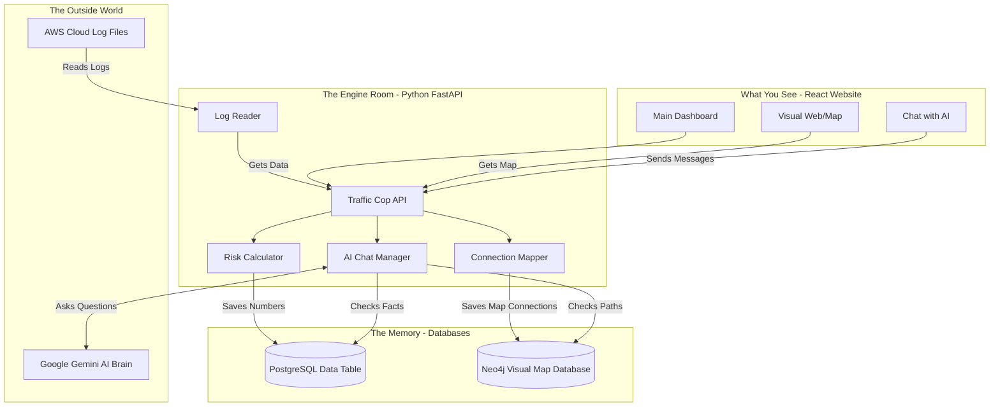
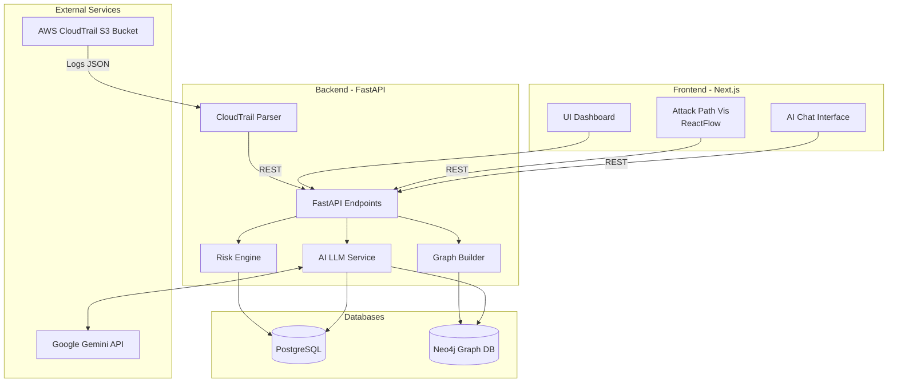

# SentinelAI 🛡️

**SentinelAI** is a Machine Identity Risk Intelligence Platform designed to provide enterprise security teams with unparalleled, actionable intelligence into the machine identity lifecycle. It transforms opaque cloud service accounts, APIs, and IAM roles into trackable, risk-quantified assets.

---

# 📖 The Beginner's Guide

Welcome to SentinelAI! If you are reading this, don't worry if you aren't a coding expert. This section is written specifically to help you run the entire project from scratch by just copying and pasting commands. 

SentinelAI is a security tool that looks at cloud logs (like a security camera for your AWS servers) and uses AI to spot if a machine (like a robot user or app) is doing something risky or dangerous.

## 🏗️ How it all connects together (Simplified)

Here is a simple map of how the different parts of this project talk to each other. Don't worry if you don't understand it all—it's just to show you the big picture!



## 🚀 Let's Get Started (Step-by-Step)

To run this app on your computer, you will need to open a **Terminal** (on Mac) or **Command Prompt/PowerShell** (on Windows). 

You will be opening **3 separate terminal windows** total to run the 3 parts of the app: The Databases, the Engine (Backend), and the Website (Frontend).

### Phase 1: Set up the Databases
We use Docker to make this easy. You must have [Docker Desktop](https://www.docker.com/products/docker-desktop/) installed and running on your computer.

1. Open your first Terminal window.
2. Ensure you are inside the `sentinel-commend` folder.
3. Run this exact command to download and start the databases:
```bash
docker compose up -d
```
*(You will see it downloading files. When it says "Started", the databases are running quietly in the background!)*

### Phase 2: Start the Engine Room (Backend)
You will need Python 3.10+ installed on your computer.

1. Open a **second, new Terminal window**.
2. Go into the backend folder by copying and pasting this:
```bash
cd sentinel_backend
```
3. Create a clean workspace for Python to install its tools (called a Virtual Environment):
```bash
python3 -m venv venv
```
4. Turn on the workspace. 
   - *If you are on Mac/Linux, run:*
     ```bash
     source venv/bin/activate
     ```
   - *If you are on Windows, run:*
     ```bash
     venv\Scripts\activate
     ```
5. Install all the necessary Python engines and tools:
```bash
pip install -r requirements.txt
```
6. Setup the database tables automatically:
```bash
alembic upgrade head
```
7. Finally, turn the engine on! 
```bash
fastapi dev app/main.py
```
*(Leave this terminal window open! The engine is now running.)*

### Phase 3: Start the Website (Frontend)
You will need [Node.js](https://nodejs.org/) installed on your computer.

1. Open a **third, new Terminal window**.
2. Go into the frontend folder:
```bash
cd sentinel_frontend
```
3. Download all the website building blocks:
```bash
npm install
```
4. Start the website!
```bash
npm run dev
```

### 🎉 Phase 4: See it working!
Open your web browser (like Chrome or Safari) and go to:
👉 **[http://localhost:3000](http://localhost:3000)**

You should now see the SentinelAI platform on your screen!

### 🔑 A quick note on the "Secret Keys"
If you want the AI chat feature to work, you need to provide a Google Gemini API key. 
1. Open the file located at `sentinel_backend/.env` in a text editor.
2. Find the line that says `GEMINI_API_KEY=your_gemini_api_key_here`.
3. Replace `your_gemini_api_key_here` with a real key from [Google AI Studio](https://aistudio.google.com/app/apikey).

---

# 💻 Technical Overview

This section is for developers and security engineers looking to understand the technical architecture and features of SentinelAI.

## 🌟 Key Features
- **CloudTrail Ingestion:** Securely ingests and parses AWS CloudTrail logs from S3 buckets.
- **Machine Identity Discovery:** Automatically extracts AWS IAM Roles and service users from logs.
- **Identity Inventory:** A comprehensive dashboard to track identities, showing first-seen, last-seen, and event volume.
- **Behavioral Risk Scoring:** Heuristic and behavioral risk-scoring engine (0-100) based on permission sensitivity, behavior deviation, and privilege escalation potential.
- **Attack Path Visualization:** Interactive graphs mapping relationships between identities, accessed resources, and potential escalation paths.
- **AI Security Analyst:** An LLM-powered chat interface capable of answering natural language security questions based on CloudTrail behavior.

## 🏗️ Technical Architecture

Below is a high-level architecture diagram of SentinelAI:



## 📂 Project Structure

```text
sentinel-commend/
├── sentinel_frontend/          # Next.js 16 + React 19 Application
│   ├── src/app/                # Next.js App Router (Pages & Layouts)
│   ├── src/components/         # React Components (UI, Recharts, ReactFlow)
│   ├── src/types/              # TypeScript Type Definitions
│   └── public/                 # Static assets
├── sentinel_backend/           # FastAPI Python Application
│   ├── app/
│   │   ├── api/                # API Endpoints (v1)
│   │   ├── core/               # Configuration & Security
│   │   ├── db/                 # PostgreSQL Sessions & Migrations
│   │   ├── graph/              # Neo4j Driver Connection
│   │   ├── models/             # SQLAlchemy ORM Models
│   │   ├── schemas/            # Pydantic Schemas
│   │   └── services/           # Business Logic (Parser, Risk Engine, LLM)
│   ├── alembic/                # Database Migrations
│   └── requirements.txt        # Python Dependencies
├── docker-compose.yml                 # Docker setup for Postgres and Neo4j
├── SentinelAI_Architecture_Design.md  # Detailed Backend/Database Schema Design
└── SentinelAI_Product_Spec.md         # Full Product Requirements & Personas
```
