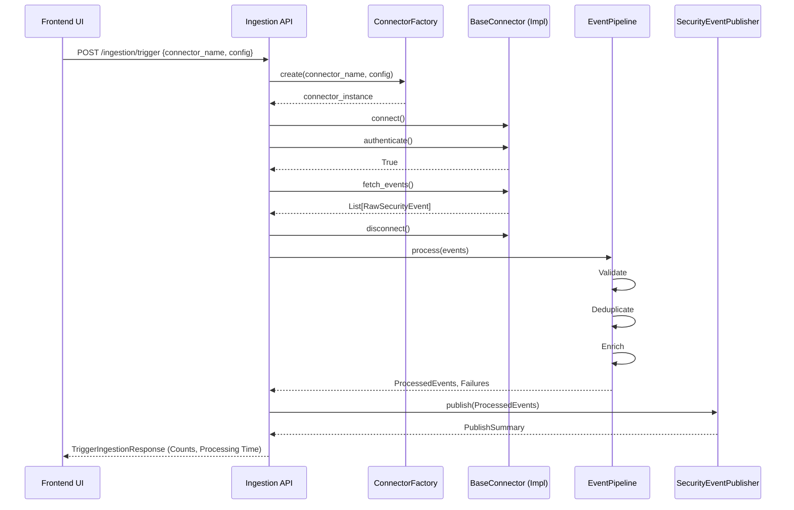

# Stage 1: Ingestion Engine Architecture

This document describes the technical architecture of the Stage 1 Ingestion Engine. 
The core objective of Stage 1 is to extract, validate, deduplicate, enrich, and publish security events from heterogeneous sources into a unified `SecurityEvent` schema for downstream stages.

## System Components

### 1. Connector Framework (`app.services.connectors`)
A dynamically extensible factory pattern for connecting to external APIs and systems.
- **BaseConnector**: Abstract base class defining `connect()`, `authenticate()`, `fetch_events()`, and `disconnect()`.
- **ConnectorRegistry**: Self-registration metaclass that automatically registers new implementations.
- **ConnectorFactory**: Instantiates the appropriate connector dynamically based on UI inputs.
- **Connectors implemented**: AWS IAM, AWS SecurityHub, Suricata, OpenVAS, Wazuh.

### 2. Ingestion Pipeline (`app.services.ingestion_pipeline`)
Processes raw events fetched by the connectors sequentially.
- **EventValidator**: Enforces schema and types, ensuring required fields exist.
- **DuplicateDetector**: Tracks recent event signatures to drop noisy/duplicated events.
- **MetadataEnricher**: Adds source tags, generic normalized timestamps, and system context.
- **DeadLetterPublisher**: Handles gracefully rejecting corrupted events.

### 3. Security Event Publisher (`app.services.security_event_publisher`)
Distributes normalized `SecurityEvent` objects to the transport layer (currently an in-memory or database sink). The events and connector health are read directly from the persistent `AccessLog` and `Integration` database tables via the `TelemetryService`, ensuring real-time metrics and UI updates reflect actual database state.

## Architecture Diagram (Mermaid)

```mermaid
graph TD
    %% Connectors Layer
    subgraph External Sources
        AWS(AWS Security Hub/IAM)
        WAZUH(Wazuh API)
        SURICATA(Suricata Logs)
        OPENVAS(OpenVAS API)
    end

    subgraph Connector Framework
        Registry[ConnectorRegistry]
        Factory[ConnectorFactory]
        Base[BaseConnector Interface]
        
        AWS -->|fetch| Base
        WAZUH -->|fetch| Base
        SURICATA -->|fetch| Base
        OPENVAS -->|fetch| Base
        
        Registry --> Factory
        Base --> Registry
    end

    subgraph Pipeline
        Validator[EventValidator]
        Dedupe[DuplicateDetector]
        Enrich[MetadataEnricher]
        
        Factory -->|List[SecurityEvent]| Validator
        Validator --> Dedupe
        Dedupe --> Enrich
    end
    
    subgraph Publisher
        Pub[SecurityEventPublisher]
        Enrich --> Pub
        Pub -->|Unified Schema| Stage2(Stage 2: Threat Graph & AI)
    end
    
    subgraph Frontend Interaction
        UI[Connector / Ingestion UI]
        API[API: /api/v1/ingestion]
        
        UI -->|Trigger Config| API
        API -->|Instantiate| Factory
        Pub -->|Telemetry & Metrics| API
        API -->|Live Updates| UI
    end
```

## Sequence Diagram: Ingestion Trigger


