That's the right approach. Let AI generate the implementation, but make **your contribution** the research, architecture understanding, infrastructure setup, validation, and demonstration. That is what interviewers and judges will ask about.

Below is a complete manual roadmap for **Stage 1 – Enterprise Data Ingestion Engine**.

---

# Stage 1 Manual Work Guide

## Goal

By the end of this manual work, you should be able to confidently explain:

> "How does raw security data from different security products become a standardized SecurityEvent that the rest of SentinelAI can use?"

Everything below is focused on answering that question.

---

# PART 1 — Research (Understand the Data Flow)

**Objective:** Understand what each security product does and what data it produces.

Don't study every feature. Study only what Stage 1 needs.

---

# 1. Wazuh

## Learn

* What is Wazuh?
* Why organizations use it
* How Wazuh collects logs
* Agent vs Manager
* REST API
* Alert JSON format

Understand:

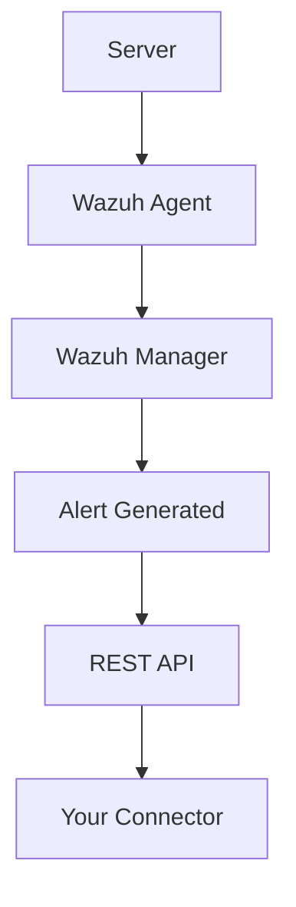

Know answers to:

* What triggers a Wazuh alert?
* What fields exist?
* Why use Wazuh?

Ignore

* Ruleset development
* Cluster architecture
* Agent deployment automation

---

# 2. Suricata

Learn

* Network IDS
* Packet inspection
* Detects attacks
* eve.json

Flow:

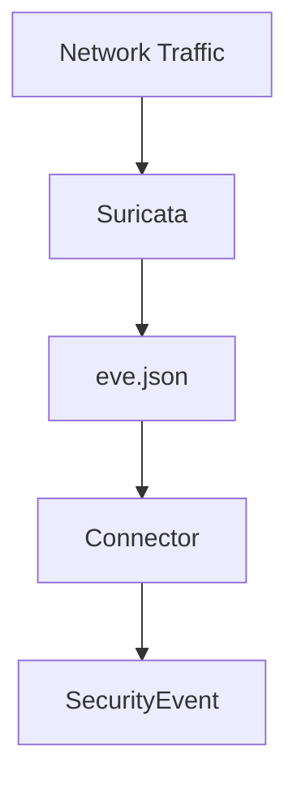

Understand

* alert
* src_ip
* dest_ip
* protocol
* severity

Ignore

* Custom detection rules
* Performance tuning

---

# 3. OpenVAS

Learn

* Vulnerability Scanner
* Scan Targets
* Scan Report
* CVE
* CVSS

Flow

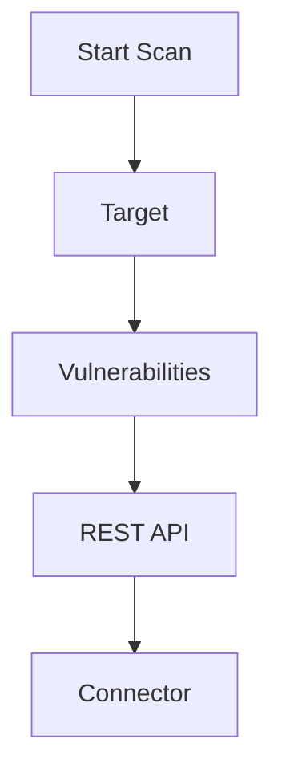

Understand

Difference between

* Scan
* Vulnerability
* Finding

---

# 4. AWS Security Hub

Study only

Security Findings

Example

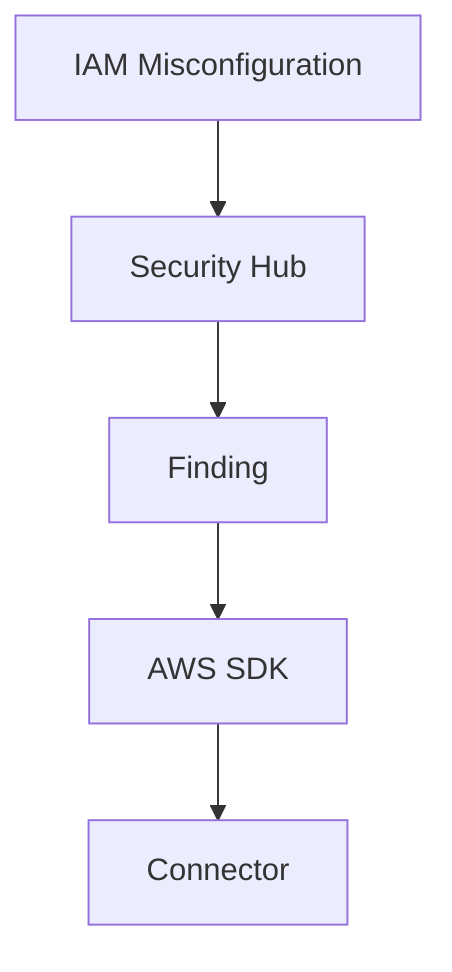

Understand

* Findings
* Severity
* Resource
* Account
* Region

Ignore

Compliance frameworks.

---

# 5. IAM Login Events

Understand

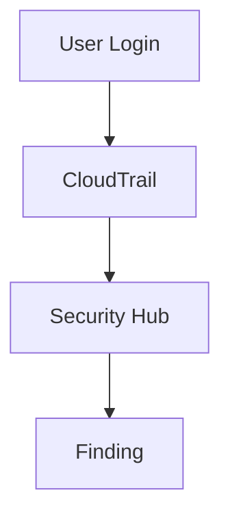

Know

Successful login

Failed login

Root login

Privilege escalation

---

# Deliverable

After research you should be able to draw this without notes.

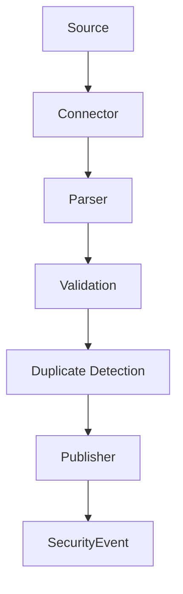

---

# PART 2 — Infrastructure Setup

This is your biggest manual contribution.

---

# Machine Setup

You should create

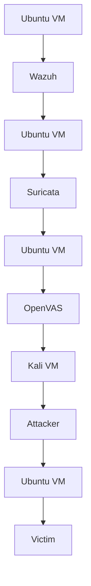

Even if later you simplify with Docker, first understand this architecture.

---

# Install Wazuh

Goal

Generate alerts.

Example attacks

SSH brute force

Failed login

File change

Privilege escalation

---

# Install Suricata

Goal

Generate

```
eve.json
```

Generate traffic

Port scan

Nmap

HTTP request

Suspicious packet

---

# Install OpenVAS

Goal

Run scans.

Generate

```
High Severity

Medium Severity

Low Severity
```

---

# Configure Networking

Verify

VMs can ping.

Suricata sees traffic.

Wazuh agent talks to manager.

OpenVAS reaches target.

---

# Generate Attacks

Create attack list.

Example

```
Nmap Scan

SSH Brute Force

File Modification

Port Scan

Failed Login

Suspicious HTTP Request

Vulnerability Scan
```

Each attack should generate data.

---

# Deliverable

By end of setup

Every tool generates logs independently.

---

# PART 3 — Review AI Generated Code

Never trust AI.

Every module should pass your checklist.

---

## Connector Checklist

✓ Authentication isolated

✓ Fetches data only

✓ No business logic

✓ Returns raw data

---

## Parser Checklist

✓ Converts raw format

↓

SecurityEvent

Nothing else.

---

## Validation Checklist

Checks

```
Required fields

Timestamp

Severity

Source

ID

```

Reject invalid events.

---

## Duplicate Detection

Ensure

Same event

↓

Hash

↓

Already exists?

↓

Ignore

---

## Publisher

Should only

```
publish(event)
```

No parsing.

No validation.

---

## Scheduler

Only

```
Run connectors every X seconds.
```

Nothing else.

---

# Folder Review

Check AI follows

```
connectors/

parser/

validator/

deduplicator/

publisher/

scheduler/

models/

config/
```

No random files.

---

# PART 4 — Integration Testing

This is where you prove Stage 1 works.

---

## Test 1

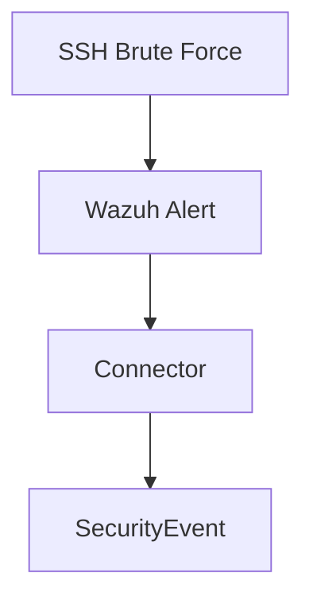

Verify

```
Source = Wazuh

Severity

Timestamp

Host

Description
```

---

## Test 2

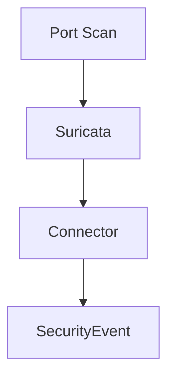

---

## Test 3

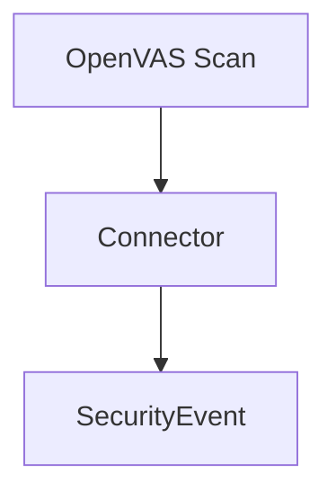

---

## Test 4

Duplicate detection

Publish same event twice.

Expected

```
Only one SecurityEvent.
```

---

## Test 5

Validation

Delete severity.

Expected

```
Rejected.
```

---

## Test 6

Malformed timestamp.

Expected

Rejected.

---

## Test 7

Connector unavailable.

Expected

Retry.

No crash.

---

## Test 8

Empty response.

Expected

No events.

No exception.

---

## Test 9

Mixed sources.

```
Wazuh

Suricata

OpenVAS
```

All become

```
SecurityEvent
```

with same schema.

---

# Deliverable

Maintain a simple test table like this:

| Test               | Input            | Expected Result       | Status |
| ------------------ | ---------------- | --------------------- | ------ |
| SSH brute force    | Wazuh alert      | SecurityEvent created | ✅      |
| Port scan          | Suricata alert   | SecurityEvent created | ✅      |
| Vulnerability scan | OpenVAS report   | SecurityEvent created | ✅      |
| Duplicate event    | Same event twice | One event stored      | ✅      |
| Missing severity   | Invalid event    | Validation rejects    | ✅      |
| Invalid timestamp  | Invalid event    | Validation rejects    | ✅      |
| Connector offline  | API unavailable  | Retry, no crash       | ✅      |
| Empty response     | No alerts        | No exceptions         | ✅      |

---

# PART 5 — Demo Preparation

This is what judges will see.

---

## Step 1 — Create an Attack Story

Instead of showing random alerts, present a connected scenario.

Example flow:

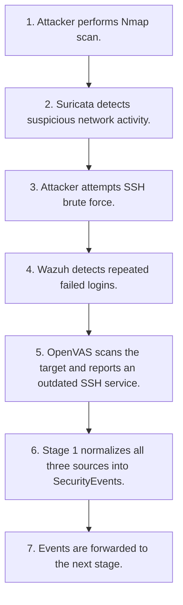

This demonstrates how different security tools observe different aspects of the same incident.

---

## Step 2 — Prepare Screenshots

Capture:

* Wazuh dashboard showing alerts
* Suricata `eve.json` or dashboard
* OpenVAS scan results
* Stage 1 logs showing connector execution
* Normalized `SecurityEvent` JSON
* Pipeline flow in the terminal or dashboard

---

## Step 3 — Prepare an Architecture Diagram

Draw:

```text
                +------------------+
                |      Wazuh       |
                +------------------+
                        |
                +------------------+
                |    Connector     |
                +------------------+
                        |
                +------------------+
                |      Parser      |
                +------------------+
                        |
                +------------------+
                |    Validator     |
                +------------------+
                        |
                +------------------+
                | Duplicate Filter |
                +------------------+
                        |
                +------------------+
                |    Publisher     |
                +------------------+
                        |
                +------------------+
                |  SecurityEvent   |
                +------------------+

(Same pipeline is used for Suricata and OpenVAS.)
```

---

## Step 4 — Prepare Your Explanation

Be ready to answer:

* Why did you choose Wazuh, Suricata, and OpenVAS?
* Why normalize everything into a common `SecurityEvent`?
* How do you prevent duplicate events?
* What happens if one connector fails?
* How is Stage 1 separated from later analysis stages?
* How would you add another data source (e.g., Microsoft Defender) without changing the pipeline?

---

# Final Manual Deliverables Checklist

By the time you start implementing the AI-generated code, you should have completed:

* ✅ Studied Wazuh, Suricata, OpenVAS, AWS Security Hub, and IAM event flows.
* ✅ Set up and verified your security tools and networking.
* ✅ Generated realistic security events (port scans, brute force, vulnerability scans, etc.).
* ✅ Reviewed every AI-generated module against Stage 1 responsibilities and folder structure.
* ✅ Executed end-to-end integration tests for all connectors, validation, and duplicate detection.
* ✅ Prepared a coherent attack story, architecture diagram, screenshots, and practiced demo script.

This division of work gives you a strong balance: **AI accelerates implementation**, while **your manual effort demonstrates engineering understanding, system integration skills, testing discipline, and the ability to explain the complete security pipeline**.
