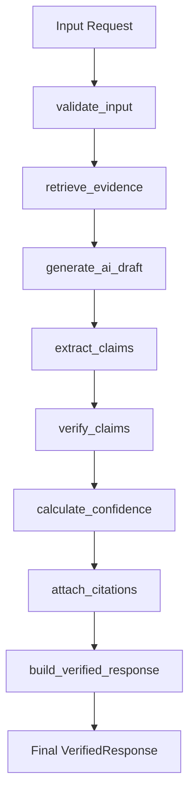

# LangGraph Execution Flow

## Workflow Diagram

## Node Responsibilities

1. **`validate_input`**: Ensures that the execution graph is initialized with a valid `workspace_id` and `identity_id`. Short-circuits with an error if missing.
2. **`retrieve_evidence`**: Replaces the old `evidence_collector.py`. Queries Postgres and Neo4j for required Identity metadata, Risk Scores, Logs, and Graph Paths, serializing them into the `RiskEvidence` Pydantic model.
3. **`generate_ai_draft`**: Injects evidence into prompt templates and invokes the LLM (Gemini 3.5 Flash). Outputs an initial `AIResponse` dictionary inside the graph state.
4. **`extract_claims`**: Parses the unstructured text within the `AIResponse` to isolate atomic, testable claims.
5. **`verify_claims`**: Checks extracted claims against the ground-truth `RiskEvidence` to detect hallucinations.
6. **`calculate_confidence`**: Determines an aggregate confidence score (0.0 to 1.0) based on the ratio of verified vs. failed claims.
7. **`attach_citations`**: Links verified claims to exact nodes or log entries in the evidence payload to build a human-readable traceback.
8. **`build_verified_response`**: Constructs the final `VerifiedResponse` model for the API to return.

## Retry Strategy

- Nodes that interact with external services (LLM, Database) will implement LangGraph's internal `retry` parameters to handle transient timeouts or `429 Too Many Requests`.
- The `retry_count` state variable will be tracked. If it exceeds the maximum threshold, the graph will gracefully exit and populate the `error_message` state field rather than crashing.

## Failure Handling

- Any fatal exception during node execution routes the graph immediately to an `END` state with a sanitized error message and sets `success=False` in the response schema.
- Verification failures do not crash the graph. Instead, they mark specific claims as `is_verified=False` and lower the `confidence_score`.

## Future Parallelization Opportunities

- **`retrieve_evidence`**: Can be broken into parallel nodes (e.g., `fetch_relational_logs`, `fetch_graph_paths`) that converge via a `join` node to reduce latency.
- **`extract_claims` / `verify_claims`**: Claims can be verified in parallel rather than sequentially, using dynamic mapping loops (a "map-reduce" style edge).

## Mapping from Existing Services to Future Nodes

| Existing Service | Future Node |
|------------------|-------------|
| `evidence_collector.py` | `retrieve_evidence` |
| `prompt_builder.py` | Built into `generate_ai_draft` |
| `ai_analyst_service.py` | `generate_ai_draft` |
| `investigation_service.py` | The overall `StateGraph` |
| *None* | `extract_claims`, `verify_claims`, `calculate_confidence`, `attach_citations`, `build_verified_response` |
