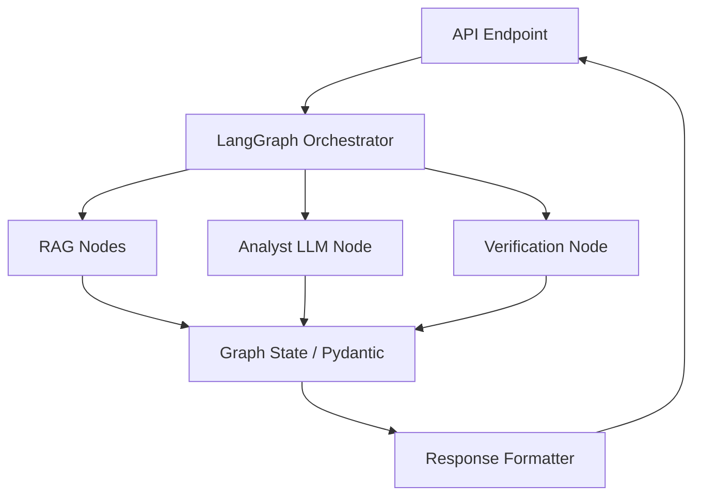

# Member 3 Execution Plan: LangGraph AI Layer Migration

## Current Architecture
The AI Intelligence Layer (`app/services/ai/`) operates as a single procedural pipeline orchestrated by `investigation_service.py`. It sequentially triggers `evidence_collector.py` for context, uses `prompt_builder.py` for static templating, and calls `ai_analyst_service.py` to communicate with the Gemini LLM. The output is a weakly-typed dictionary.

## Target Architecture
An enterprise-grade, state-driven workflow utilizing LangGraph. The monolithic process will be broken down into specialized graph nodes (RAG retrieval, Analysis, Verification, Explanation, Formatting). State will be strictly enforced using Pydantic v2 schemas (`RiskEvidence`, `AIResponse`, `VerifiedResponse`).

## Migration Phases

### Phase 1: Contract Enforcement (Current Sprint)
- Define Pydantic v2 enterprise contracts under `app/schemas/`.
- Establish target module directories for the future LangGraph implementation without altering existing logic.

### Phase 2: Tool & Node Implementation
- Refactor `evidence_collector.py` into distinct RAG tools inside `app/services/rag/`.
- Convert `prompt_builder.py` strings into typed `ChatPromptTemplate` configurations inside `app/services/prompts/`.
- Implement standalone Node functions for Analyst, Verifier, and Formatter.

### Phase 3: Graph Compilation
- Build the `StateGraph` in `app/services/langgraph/graph.py`.
- Link the nodes, define conditional edges (e.g., self-correction loops upon verification failure), and compile the graph.

### Phase 4: Verification & Explainability
- Implement ground-truth checking in `app/services/verification/`.
- Implement narrative generation in `app/services/explainability/`.

### Phase 5: Integration & Cutover
- Update the `/investigate` endpoint in `app/api/v1/endpoints/ai.py` to route traffic to the new compiled LangGraph rather than `InvestigationService`.
- Deprecate old monolithic files.

## Component Dependency Graph

## Module Ownership
- **Schemas**: `app/schemas/` (Pydantic models)
- **State Management**: `app/services/langgraph/`
- **Context/Tools**: `app/services/rag/`
- **Templates**: `app/services/prompts/`
- **Output Safety**: `app/services/verification/` & `app/services/explainability/`

## Integration Points
- **API Endpoints**: `app/api/v1/endpoints/ai.py` must eventually accept `VerifiedResponse` models.
- **Neo4j / PostgreSQL**: Accessed exclusively via tools in the `rag` module.

## Risks
1. **Latency**: Adding verification nodes loops and multi-step reasoning can increase response time. Streaming responses may be necessary.
2. **Context Limits**: Storing large amounts of graph edges in the LangGraph state could exceed LLM context windows. Token reduction strategies are needed in the RAG layer.
3. **Graph Complexity**: Complex conditional edges (e.g. endless self-correction loops) must have strict `max_retries` thresholds.

## Testing Strategy
- **Unit Tests**: Test individual nodes and tools (e.g. mock the LLM for the Verification Node).
- **Integration Tests**: Provide mock `RiskEvidence` and execute the full compiled graph to ensure state transitions correctly.
- **Shadow Mode**: Run the new LangGraph side-by-side with the old `InvestigationService` in production and compare results before the final cutover.
